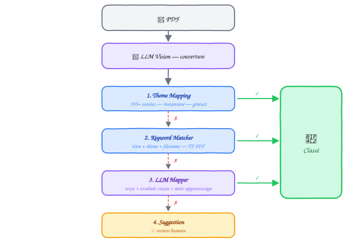
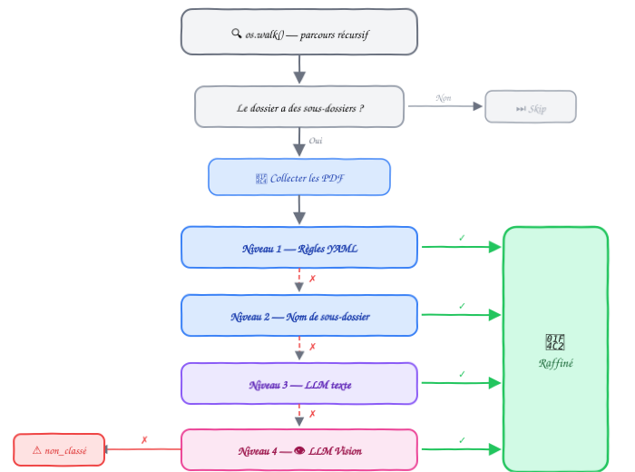

<p align="center">
  
</p>

<p align="center">
  <strong>Organisez automatiquement votre bibliothèque PDF avec l'IA.</strong>
</p>

<p align="center">
  
  
  
  
  
</p>

<p align="center">
  <a href="#installation">Installation</a> •
  <a href="#démarrage-rapide">Démarrage rapide</a> •
  <a href="#commandes">Commandes</a> •
  <a href="docs/architecture.md">Architecture</a> •
  <a href="docs/profils.md">Profils</a> •
  <a href="docs/contributing.md">Contribuer</a>
</p>

---

## Présentation

**Klodo** est un outil CLI qui organise automatiquement de grandes bibliothèques de fichiers PDF. Il combine un modèle de vision (LLM Vision) pour identifier les livres par leur couverture, un système de classification hybride à 4 niveaux, et un mécanisme d'auto-apprentissage qui s'améliore à chaque utilisation.

Déposez vos PDF, lancez une commande, récupérez une bibliothèque classée.

<p align="center">
  
</p>

### Chiffres clés

| Métrique | Valeur |
|---|---|
| PDFs traités | 19 259 |
| Taux de classement | 96.1% |
| Catégories | 88 dossiers |
| Thèmes auto-appris | 355+ |
| Coût API total | ~$6 |

## Installation

**Prérequis** : Python 3.9+, macOS ou Linux.

```bash
# Cloner
git clone https://github.com/votre-user/klodo.git
cd klodo

# Dépendances système (macOS)
brew install poppler

# Dépendances Python
pip3 install -r requirements.txt

# Clé API SiliconFlow (gratuit pour les modèles open-source)
export SILICONFLOW_API_KEY=votre-clé-api
```

<details>
<summary><strong>Installation sur Linux (Debian/Ubuntu)</strong></summary>

```bash
sudo apt-get install poppler-utils
pip3 install -r requirements.txt
```
</details>

## Démarrage rapide

```bash
# 1. Dry-run : voir ce que Klodo ferait (sans rien modifier)
./klodo.sh process /chemin/vers/nouveaux_pdfs

# 2. Exécuter : renommer, classifier et copier les fichiers
./klodo.sh process /chemin/vers/nouveaux_pdfs --execute

# 2b. Sans renommage (fichiers déjà bien nommés)
./klodo.sh process /chemin/vers/nouveaux_pdfs --no-rename --execute

# 3. Raffiner les sous-catégories
./klodo.sh refine --llm --vision --execute --workers 10

# 4. Reviewer les suggestions de nouveaux dossiers
./klodo.sh suggest
```

## Commandes

| Commande | Description | Documentation |
|---|---|---|
| `process` | Pipeline complet : rename → classify → copie → refine | [classification.md](docs/classification.md) |
| `classify` | Classification seule (pas de renommage) | [classification.md](docs/classification.md) |
| `rename` | Renommage intelligent (ISBN, métadonnées, LLM Vision) | [renommage.md](docs/renommage.md) |
| `refine` | Raffinement récursif des sous-catégories | [raffinement.md](docs/raffinement.md) |
| `suggest` | Review des suggestions de nouveaux dossiers | [classification.md](docs/classification.md#niveau-4--suggestions) |
| `profiles` | Lister les profils disponibles | [profils.md](docs/profils.md) |
| `init` | Créer un nouveau profil | [profils.md](docs/profils.md#créer-un-profil) |

### Exemples rapides

```bash
# Classifier 50 fichiers avec détails + escalade vision
./klodo.sh classify /chemin --max 50 --verbose --vision --pages 2 --workers 10

# Renommer avec LLM Vision (3 pages pour les livres LNCS)
./klodo.sh rename /chemin --llm --force --pages 3 --execute

# Raffiner avec escalade vision pour les cas difficiles
./klodo.sh refine --llm --vision --workers 10 --execute

# Retraiter les erreurs du dernier run
./klodo.sh classify /chemin --retry-errors --execute
```

### Options communes

| Option | Description |
|---|---|
| `--profile NAME` | Profil à utiliser (défaut : `default`) |
| `--execute` | Appliquer les modifications (sinon dry-run) |
| `--verbose`, `-v` | Mode détaillé |
| `--workers N`, `-w N` | Threads parallèles |
| `--max N` | Limiter à N fichiers |

> Chaque commande a des options spécifiques — consultez la doc du module correspondant.

## Comment ça marche

Klodo utilise un pipeline à 4 niveaux de classification qui essaie chaque méthode dans l'ordre, de la plus rapide à la plus intelligente :

<p align="center">
  
</p>

Le raffinement utilise ensuite une escalade en 4 niveaux pour placer chaque fichier dans le bon sous-dossier :

<p align="center">
  
</p>

> Pour les détails techniques de chaque module, consultez la documentation dédiée dans le dossier [`docs/`](docs/).

## Documentation

| Document | Contenu |
|---|---|
| [Architecture](docs/architecture.md) | Structure du projet, modules, flux de données |
| [Classification](docs/classification.md) | Pipeline 4 niveaux, auto-apprentissage, suggestions |
| [Renommage](docs/renommage.md) | Pipeline rename, ISBN, LLM Vision multi-pages |
| [Raffinement](docs/raffinement.md) | Refine récursif, 3 niveaux + escalade vision |
| [Profils](docs/profils.md) | Configuration YAML, multi-bibliothèques, LLM |
| [Contribuer](docs/contributing.md) | Guide de contribution, tests, conventions |

## Performances

Testé sur une bibliothèque de ~19 000 fichiers PDF (SSD externe, Mac M4 Max) :

```
📊 Classification : 96.1% des fichiers classés automatiquement
⚡ Vitesse        : ~10 fichiers/seconde avec --workers 10
💰 Coût           : ~$6 pour 19 259 fichiers (SiliconFlow, modèles gratuits)
🔄 Auto-learning  : 355+ thèmes appris, chaque run enrichit le mapping
```

## Licence

[MIT License](LICENSE) — libre d'utilisation, modification et distribution.

---

<p align="center">
  <sub>Développé par <a href="https://github.com/votre-user">Walid Namane</a> avec l'aide de <a href="https://claude.ai">Claude</a>.</sub>
</p>
