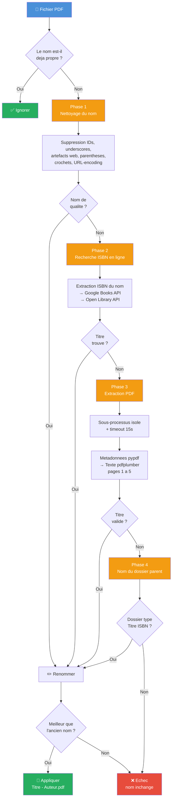

# Biblio Renamer

Renommage intelligent de bibliothèques PDF vers la nomenclature **"Titre - Auteur.pdf"**.

Concu pour nettoyer des bibliothèques PDF dont les fichiers ont des noms cryptiques (ISBN, DOI, identifiants numeriques, artefacts de telechargement Z-Library/Bookos, etc.).

## Fonctionnement

Le script applique un pipeline en cascade pour chaque fichier PDF. Si une etape produit un nom de qualite suffisante, les etapes suivantes sont ignorees.



Le script ne modifie **que les fichiers dont le nom est "pas propre"**. Il peut etre relance autant de fois que necessaire.

## Installation

```bash
git clone https://github.com/VOTRE_USER/biblio-renamer.git
cd biblio-renamer
pip install -r requirements.txt
```

## Usage

### Rapport seul (rien n'est modifie)

```bash
./renommer.sh /chemin/vers/biblio
```

Genere un fichier CSV avec tous les renommages proposes.

### Appliquer les renommages

```bash
./renommer.sh /chemin/vers/biblio --execute
```

### Annuler

```bash
./renommer.sh --undo log_renommage_XXXXXXXX.csv
```

### Options

```
--no-online    Desactiver la recherche ISBN en ligne
--no-pdf       Desactiver l'extraction depuis les PDFs (plus rapide)
--report X.csv Utiliser un rapport specifique pour --execute
```

## Nomenclature

- Format : `Titre - Premier Auteur.pdf` ou `Titre.pdf` (si auteur inconnu)
- Accents preserves
- Caracteres supprimes : `()[]{},:;`
- Caracteres conserves : lettres, chiffres, espaces, apostrophes, tirets, points

## Exemples

| Avant | Apres |
|-------|-------|
| `2738119042.pdf` | `Les origines animales de la culture - Dominique Lestel.pdf` |
| `[Ghaleb_Bencheikh]_Le_Coran.pdf` | `Le Coran - Ghaleb Bencheikh.pdf` |
| `0471137707 Computingverybest.pdf` | `Computing concepts with C++ essentials - Horstmann.pdf` |
| `Islam et politique (Mohamed Arkoun) (Z-Library).pdf` | `Islam et politique - Mohamed Arkoun.pdf` |
| `9780195153729 1.pdf` | `Adaptive Thinking - Rationality in the Real World - Gerd Gigerenzer.pdf` |

## Fichiers generes

- `rapport_XXXXXXXX.csv` : rapport des renommages proposes
- `log_renommage_XXXXXXXX.csv` : log des renommages effectues (pour annulation)
- `isbn_cache.json` : cache des recherches ISBN (evite les requetes repetees)

## Licence

MIT
