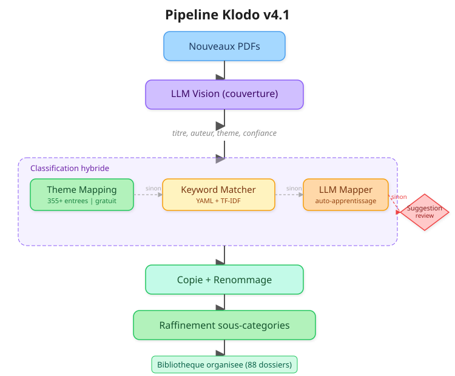

<p align="center">
  
</p>

<p align="center">
  <strong>Organisez automatiquement votre bibliothèque PDF avec l'IA.</strong>
</p>

<p align="center">
  
  
  
  
</p>

<p align="center">
  <a href="#fonctionnalités">Fonctionnalités</a> •
  <a href="#installation">Installation</a> •
  <a href="#démarrage-rapide">Démarrage rapide</a> •
  <a href="#commandes">Commandes</a> •
  <a href="#profils">Profils</a> •
  <a href="#architecture">Architecture</a>
</p>

---

## Présentation

**Biblio** est un outil en ligne de commande qui organise automatiquement de grandes bibliothèques de fichiers PDF. Il combine un modèle de vision (LLM Vision) pour identifier les livres par leur couverture, un système de classification hybride, et un mécanisme d'auto-apprentissage qui s'améliore à chaque utilisation.

Déposez vos PDF, lancez une commande, récupérez une bibliothèque classée.

<p align="center">
  
</p>

## Fonctionnalités

**Pipeline complet en une commande** — Identification par couverture, renommage intelligent, classement thématique et raffinement en sous-catégories, le tout avec `./biblio.sh process`.

**Classification hybride à 4 niveaux** — Le système essaie, dans l'ordre : le mapping de thèmes (rapide, gratuit), les mots-clés YAML (fallback), le LLM Mapper texte (résolution intelligente), puis un fallback basse confiance. Chaque niveau couvre les cas que le précédent ne peut pas résoudre.

**Auto-apprentissage** — Quand un thème inconnu est résolu par le LLM Mapper, il est automatiquement ajouté dans le fichier de mapping. La prochaine fois, il sera résolu instantanément sans appel API.

**Suggestions intelligentes** — Quand aucun dossier existant ne convient, le système propose la création de nouveaux dossiers. Vous reviewez, modifiez si besoin, et appliquez d'un clic.

**Checkpoint / reprise** — Interruption avec Ctrl+C, sauvegarde atomique, reprise automatique au relancement. Aucun travail n'est perdu.

**Multithreading** — Parallélisez les appels API avec `--workers N` pour traiter des milliers de fichiers efficacement.

**Profils** — Gérez plusieurs bibliothèques avec des configurations indépendantes (arborescence, mappings, règles de raffinement).

**LLM flexible** — SiliconFlow (cloud) ou Ollama (local) configurable dans le profil. Changez de provider en une ligne YAML.

## Installation

**Prérequis** : Python 3.9+, macOS ou Linux.

```bash
# Cloner le repo
git clone https://github.com/votre-user/Manage-Biblio.git
cd Manage-Biblio

# Dépendances système (macOS)
brew install poppler

# Dépendances Python
pip3 install -r requirements.txt

# Clé API SiliconFlow (gratuit pour les modèles open-source)
export SILICONFLOW_API_KEY=sk-xxx
```

<details>
<summary><strong>Installation sur Linux</strong></summary>

```bash
# Debian / Ubuntu
sudo apt-get install poppler-utils

# Dépendances Python
pip3 install -r requirements.txt
```

</details>

## Démarrage rapide

```bash
# 1. Dry-run : voir ce que Biblio ferait (sans rien modifier)
./biblio.sh process /chemin/vers/nouveaux_pdfs

# 2. Exécuter : copier les fichiers classifiés dans la bibliothèque
./biblio.sh process /chemin/vers/nouveaux_pdfs --execute

# 3. Reviewer les suggestions de nouveaux dossiers
./biblio.sh suggest

# 4. Appliquer les suggestions validées
./biblio.sh suggest --apply --execute
```

## Commandes

### `process` — Pipeline complet

Enchaîne automatiquement : identification LLM Vision, renommage, classification et raffinement.

```bash
./biblio.sh process /chemin/vers/pdfs                    # Dry-run
./biblio.sh process /chemin/vers/pdfs --execute           # Appliquer
./biblio.sh process /chemin/vers/pdfs --workers 10        # Paralléliser
./biblio.sh process /chemin/vers/pdfs --max 50 --verbose  # Test limité
```

### `classify` — Classification seule

Identification par LLM Vision et classement thématique, sans renommage ni raffinement.

```bash
./biblio.sh classify /chemin --workers 10
./biblio.sh classify /chemin --retry-errors --execute   # Retraiter les erreurs
./biblio.sh classify /chemin --reclassify --execute     # Re-mapper sans appel API
./biblio.sh classify /chemin --reset                    # Recommencer à zéro
```

### `rename` — Renommage intelligent

Renomme les fichiers au format `Titre - Auteur.pdf` via un pipeline en cascade : nettoyage du nom, recherche ISBN, extraction des métadonnées PDF, et optionnellement analyse de la couverture par LLM Vision.

```bash
./biblio.sh rename /chemin                          # Dry-run (ISBN + métadonnées PDF)
./biblio.sh rename /chemin --execute                # Appliquer
./biblio.sh rename /chemin --llm                    # Activer LLM Vision en fallback
./biblio.sh rename /chemin --llm --pages 2          # Analyser 2 pages (couverture + page titre)
./biblio.sh rename /chemin --llm --force            # Forcer l'analyse LLM en priorité
./biblio.sh rename /chemin --llm --force --pages 3  # Force + 3 pages pour les LNCS, etc.
./biblio.sh rename /chemin --max 10 --verbose       # Test limité avec détails
./biblio.sh rename /chemin --no-online              # Sans recherche ISBN en ligne
```

Le pipeline de renommage essaie, dans l'ordre : nettoyage du nom de fichier, recherche ISBN en ligne, extraction depuis les métadonnées PDF, analyse de couverture par LLM Vision (si `--llm`), puis titre depuis le dossier parent. Chaque étape n'est essayée que si les précédentes n'ont pas trouvé de bon titre.

Avec `--force`, le LLM Vision passe en priorité (avant ISBN et PDF) pour forcer une analyse fraîche. Avec `--pages N`, le LLM reçoit les N premières pages au lieu de la seule couverture, ce qui permet d'identifier les livres dont le vrai titre est sur la page intérieure (typiquement les collections Springer LNCS).

### `refine` — Raffinement sous-catégories

Déplace les fichiers des catégories parentes vers les bonnes sous-catégories en analysant les mots-clés.

```bash
./biblio.sh refine                   # Dry-run sur toute la bibliothèque
./biblio.sh refine --execute         # Appliquer
```

### `suggest` — Gestion des suggestions

Review et application des propositions de nouveaux dossiers générées automatiquement.

```bash
./biblio.sh suggest                        # Voir les suggestions
./biblio.sh suggest --apply                # Créer les dossiers validés
./biblio.sh suggest --apply --execute      # Créer + reclassifier
```

### `profiles` / `init` — Gestion des profils

```bash
./biblio.sh profiles                                    # Lister les profils
./biblio.sh init mon-profil --target /chemin/biblio     # Créer un profil
./biblio.sh process /chemin --profile mon-profil        # Utiliser un profil
```

### Options par commande

**Options communes** (toutes les commandes) :

| Option | Description |
|---|---|
| `--profile NAME` | Profil à utiliser (défaut : `default`) |
| `--execute` | Appliquer les modifications (sinon dry-run) |
| `--report` | Générer un rapport CSV |
| `--verbose`, `-v` | Mode détaillé |

**Options classify / process** (LLM Vision + classification) :

| Option | Description |
|---|---|
| `--api-key KEY` | Clé API (ou variable `SILICONFLOW_API_KEY`) |
| `--workers N`, `-w N` | Threads parallèles (0 = défaut du profil) |
| `--max N` | Limiter à N fichiers |
| `--delay SEC` | Délai entre requêtes séquentielles (défaut: 0.2) |
| `--reset` | Supprimer le checkpoint et recommencer |
| `--retry-errors` | Retraiter les fichiers en erreur |
| `--reclassify` | Re-mapper les thèmes sans rappeler l'API |

**Options rename** (renommage intelligent) :

| Option | Description |
|---|---|
| `--llm` | Activer LLM Vision en fallback (analyse couverture) |
| `--force` | LLM en priorité + re-analyser les noms "propres" |
| `--pages N` | Pages à analyser par LLM Vision (défaut: 1, max: 5) |
| `--max N` | Limiter à N fichiers |
| `--api-key KEY` | Clé API pour `--llm` (ou variable `SILICONFLOW_API_KEY`) |
| `--no-online` | Désactiver la recherche ISBN en ligne |
| `--no-pdf` | Désactiver l'extraction des métadonnées PDF |

## Comment ça marche

Le **Theme Mapping** est la voie rapide : recherche directe dans un dictionnaire de 355+ thèmes connus. Gratuit et instantané. Le **Keyword Matcher** intervient en fallback avec des mots-clés pondérés et un classifieur TF-IDF. Le **LLM Mapper** est le dernier recours intelligent : un appel LLM texte pour demander "dans quel dossier ce thème irait-il ?". Le résultat est **auto-appris** dans le mapping pour la prochaine fois.

Le pipeline de renommage fonctionne en cascade : chaque étape n'est essayée que si les précédentes n'ont pas trouvé de bon titre. Avec `--force`, le LLM Vision est appelé en priorité. Avec `--pages N`, il analyse plusieurs pages pour trouver le vrai titre (utile pour les collections type Springer LNCS).

<p align="center">
  
</p>

Si même le LLM Mapper ne trouve pas de dossier adapté, il génère une **suggestion** que vous pouvez reviewer et appliquer.

## Profils

Un profil définit une configuration complète pour une bibliothèque : arborescence cible, mappings, mots-clés et règles de raffinement. Chaque utilisateur peut avoir ses propres profils.

```
profiles/
└── default/
    ├── profile.yaml          # Config (nom, cible, LLM, options)
    ├── tree.yaml             # Arborescence des dossiers (88 dossiers)
    ├── theme_mapping.yaml    # Mapping thème → chemin (355+ entrées, auto-enrichi)
    ├── categories.yaml       # Mots-clés de classification
    └── refinement.yaml       # Règles de raffinement (45 règles)
```

Pour créer un profil personnalisé :

```bash
./biblio.sh init ma-biblio --target /Volumes/MonDisque/LIVRES
# Éditez les fichiers YAML dans profiles/ma-biblio/
./biblio.sh process /chemin --profile ma-biblio
```

### Configuration LLM

Le fichier `profile.yaml` permet de basculer entre SiliconFlow (cloud) et Ollama (local) :

```yaml
llm:
  provider: siliconflow
  model: Qwen/Qwen3-VL-8B-Instruct
  endpoint: https://api.siliconflow.com/v1/chat/completions

# Ou pour Ollama (local) :
# llm:
#   provider: ollama
#   model: qwen2.5-vl:7b
#   endpoint: http://localhost:11434/v1/chat/completions
```

## Architecture du projet

```
Manage-Biblio/
├── biblio.py                  Point d'entrée CLI (sous-commandes argparse)
├── biblio.sh                  Lanceur (vérifie deps, SSD, API key)
├── lib/
│   ├── profile.py             Gestion des profils YAML
│   ├── vision.py              Appel LLM Vision (SiliconFlow / Ollama)
│   ├── classifier.py          Classification hybride (4 niveaux)
│   ├── llm_mapper.py          LLM Mapper + auto-apprentissage + suggestions
│   ├── checkpoint.py          Reprise / checkpoint thread-safe
│   ├── refiner.py             Raffinement sous-catégories
│   └── utils.py               Utilitaires (renommage, rapports CSV)
├── profiles/
│   └── default/               Profil par défaut
├── organiser/
│   ├── biblio_organizer.py    Classifieur mots-clés + TF-IDF
│   └── categories.yaml        Configuration mots-clés
├── renommage/
│   ├── biblio_renamer.py      Moteur de renommage (ISBN, métadonnées)
│   └── isbn_cache.json        Cache ISBN local
├── requirements.txt
├── docs/
│   └── logo.svg
└── logs/                      Rapports CSV, checkpoints, suggestions
```

## Performances

Testé sur une bibliothèque de ~19 000 fichiers PDF :

| Métrique | Valeur |
|---|---|
| Fichiers scannés | 19 259 |
| Classifiés | 18 505 (96.1%) |
| Non identifiés | 606 |
| Non classifiés | 121 |
| Corrompus | 21 |
| Coût API total | ~$6 |
| Thèmes dans le mapping | 355+ (auto-enrichi) |
| Dossiers cibles | 88 |

## Dépendances

```
pdf2image          Extraction de couvertures PDF
Pillow             Traitement d'images
pyyaml             Configuration YAML
requests           Appels API LLM
pypdf              Métadonnées PDF
pdfplumber         Extraction de contenu PDF
```

Dépendance système : `poppler` (extraction PDF → image).

## Contribuer

Les contributions sont les bienvenues. Quelques idées :

- Support de nouveaux providers LLM (OpenAI, Anthropic, Mistral)
- Interface web pour le review des suggestions
- Détection automatique de la langue du PDF
- Export des statistiques de classification

## Licence

MIT License. Voir [LICENSE](LICENSE) pour plus de détails.

---

<p align="center">
  Développé avec l'aide de <a href="https://claude.ai">Claude</a> par Anthropic.
</p>
