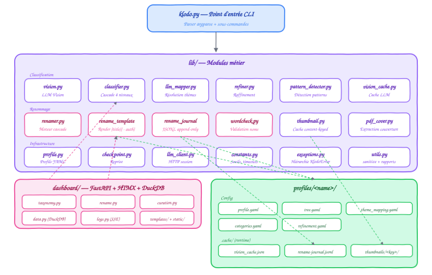
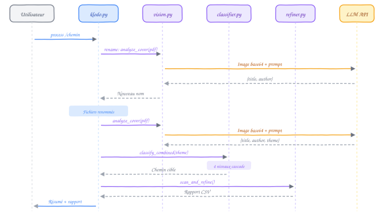

# Architecture

[← Retour au README](../README.md)

## Vue d'ensemble

Klodo est un outil CLI modulaire construit autour d'un pipeline de traitement de fichiers PDF. Chaque étape du pipeline est implémentée dans un module indépendant sous `lib/`, orchestré par le point d'entrée `klodo.py`.

<p align="center">
  
</p>

## Structure du projet

```
klodo/
├── klodo.py                   Point d'entrée CLI (sous-commandes argparse)
├── klodo.sh                   Lanceur shell (vérifie deps, SSD, API key)
│
├── lib/                       Modules métier
│   ├── __init__.py            Version (1.0.0-dev)
│   ├── constants.py           Constantes centralisées (timeouts, seuils, retries)
│   ├── exceptions.py          Hiérarchie d'exceptions (KlodoError → ...)
│   ├── llm_client.py          Client HTTP unifié (requests.Session, retries)
│   ├── vision.py              Extraction couverture + appel LLM Vision
│   ├── classifier.py          Classification hybride (4 niveaux)
│   ├── keyword_classifier.py  Classifieur YAML + TF-IDF
│   ├── llm_mapper.py          Résolution LLM de thèmes + auto-apprentissage
│   ├── refiner.py             Raffinement récursif (3 niveaux + vision)
│   ├── renamer.py             Moteur de renommage (ISBN, PDF, LLM Vision, name_patterns)
│   ├── wordcheck.py           Validation noms par dictionnaire (EN+FR)
│   ├── pattern_detector.py    Détection LLM de patterns de nommage
│   ├── thumbnail.py           Génération thumbnails PDF/ePub multi-pages
│   ├── checkpoint.py          Checkpoint / reprise thread-safe
│   ├── profile.py             Chargement profils YAML
│   ├── utils.py               Sanitize, rapports CSV, résumés
│   └── logger.py              Logger configurable (console + fichier)
│
├── commands/                  Sous-commandes CLI
│   ├── __init__.py            Exports (re-exports explicites)
│   ├── helpers.py             Helpers partagés (copie, classify, SafetyError)
│   ├── classify.py            cmd_classify + scan_and_classify
│   ├── rename.py              cmd_rename
│   ├── refine.py              cmd_refine
│   ├── process.py             cmd_process (pipeline complet)
│   ├── detect.py              cmd_detect (pattern detector LLM)
│   └── misc.py                cmd_profiles, cmd_init, cmd_suggest, cmd_clean
│
├── profiles/                  Profils de configuration
│   └── default/
│       ├── .cache/            Cache du profil (gitignored)
│       │   ├── progress.json  Checkpoint de progression
│       │   └── isbn_cache.json Cache ISBN (~3400 entrées)
│       ├── profile.yaml       Config générale (LLM, seuils, options)
│       ├── tree.yaml          Arborescence cible (88 dossiers)
│       ├── theme_mapping.yaml Mapping thème → chemin (355+ entrées)
│       ├── categories.yaml    Mots-clés de classification (7 sections)
│       └── refinement.yaml    Règles de raffinement (45 règles)
│
├── scripts/                   Scripts utilitaires
│   ├── flatten_to_inbox.sh    Remise à plat des PDFs vers _INBOX (+ restore noms)
│   ├── restore_original_names.py  Restaure les noms d'origine depuis les logs
│   └── clean_logs.sh          Nettoyage des rapports CSV
│
├── tests/                     Suite de tests (360+ tests)
│   ├── run_all.sh             Lanceur de tests
│   ├── test_compile.py        Compilation
│   ├── test_imports.py        Imports croisés
│   ├── test_safety.py         Sécurité inbox (6 tests)
│   ├── test_copy.py           Copie + suppression (14 tests)
│   ├── test_parser.py         Parser CLI (22 tests)
│   ├── test_classifier.py     Classification (25 tests)
│   ├── test_llm_client.py     Client HTTP (20 tests)
│   ├── test_rename_llm.py     Rename + LLM (18+ tests)
│   ├── test_refine.py         Refine récursif + vision (60+ tests)
│   ├── test_integration.py    Tests intégration (6 tests)
│   └── CAHIER_DE_TESTS.md     Documentation complète des tests
│
├── docs/                      Documentation
├── logs/                      Rapports CSV horodatés (gitignored)
├── pyproject.toml             Config projet, dépendances, ruff
└── LICENSE
```

## Modules

### `vision.py` — LLM Vision

Gère l'extraction de couvertures PDF et l'appel à un modèle de vision (SiliconFlow ou Ollama). Retourne un titre, auteur, thème et score de confiance.

Fonctions principales : `extract_cover_image()`, `image_to_base64()`, `call_vision_api()`, `analyze_cover()`.

→ [Documentation complète](classification.md)

### `classifier.py` — Classification hybride

Orchestre les 4 niveaux de classification : theme mapping, keyword matcher (TF-IDF), LLM mapper, et fallback basse confiance. Délègue à `lib/keyword_classifier.py` pour le matching par mots-clés.

→ [Documentation complète](classification.md)

### `llm_mapper.py` — Résolution de thèmes

Quand le theme mapping et les mots-clés échouent, envoie le thème au LLM pour trouver le bon dossier. Le résultat est auto-appris dans `theme_mapping.yaml` pour les prochaines fois.

→ [Documentation complète](classification.md#niveau-3--llm-mapper)

### `refiner.py` — Raffinement

Parcours récursif de l'arborescence avec `os.walk()`. Détecte les fichiers mal placés (dans un dossier non-feuille) et les déplace vers le bon sous-dossier via 3 niveaux de matching + escalade vision.

→ [Documentation complète](raffinement.md)

### `checkpoint.py` — Reprise

Sauvegarde atomique et thread-safe de l'état de progression. Permet l'interruption par Ctrl+C et la reprise automatique au relancement.

### `profile.py` — Profils

Charge et valide les fichiers YAML d'un profil. Supporte les valeurs par défaut et la résolution de chemins.

→ [Documentation complète](profils.md)

### `utils.py` — Utilitaires

Sanitize des noms de fichiers, génération de rapports CSV, résumés console, et fonctions de renommage partagées.

### `rename_template.py` — Moteur de template (audit dashboard)

Parser + renderer pour le pattern de renommage configurable (`{title}{ - author}` par défaut, blocs optionnels `{ - var }`, sanitization NFKC + chars FS-safe, troncature word-boundary). Utilisé par le sous-onglet **Rename** du dashboard pour proposer un nom suggéré à partir des metadata LLM.

### `rename_journal.py` — Journal de renommages

Persistance append-only JSONL des opérations de renommage (`profile/.cache/rename-journal.jsonl`). Gère `append_rename`, `undo_record` (avec guard case-insensitive APFS), `undo_batch` (records groupés par `batch_id` partagé). Les undos sont eux-mêmes journalisés sous `batch: "undo-<batch_id>"` pour audit trail complet.

→ [Documentation complète](renommage.md#renommage-dashboard--audit-journal-undo)

### `thumbnail.py` — Génération de miniatures (PDF + ePub)

Génère les pages JPEG 400×550 pour le viewer du dashboard. **Cache content-keyed** : `profile/.cache/thumbnails/<MD5_head_bytes>[16]/{1..n}.jpg` — la clé survit aux renames. Idempotent au niveau page (skip si `N.jpg` existe). Helper `compute_content_key(path)` exposé pour aligner le pipeline LLM (qui peut sauver le thumbnail au passage via `save_pil_images_as_thumbnails`).

CLI dédiée : `./klodo.sh thumbnails --execute [--pages N] [--max M] [--force]` pour backfill batch.

## Dashboard FastAPI

Le module `dashboard/` est une appli FastAPI + Jinja2 + HTMX qui sert d'IDE pour la bibliothèque (port 8080). Quatre couches :

- **Routes** (`dashboard/app.py`) — **7 onglets** (refactor UX juin 2026) : Overview · Tests · Curation · Baseline · Taxonomie · Logs · Admin. Deux hubs avec sub-tabs server-rendered : `/tests?view=X` (5 sub-tabs) et `/baseline?view=X` (2 sub-tabs). Anciennes routes (`/rapports`, `/comparer`, `/metriques`, `/historique`, `/suggestions`) → redirects HTTP 301 avec préservation des query params.
- **Couche données** (`dashboard/data.py`) — fusion YAML + JSON + DuckDB + CSV + helpers viewer
- **Modules dédiés** :
  - `overview.py` — cockpit Biblio profile-aware (16 cards + 2 builders + cache TTL 30 s thread-safe)
  - `taxonomy.py` — agrégation `tree.yaml + theme_mapping.yaml + vision_cache.json`, drag-drop, backup auto, lock concurrence, ops fichier (delete soft / move avec impact preview / bulk), cascade rename folder → categories.yaml, breakdown 3-way du routage
  - `rename.py` — audit + apply + journal + undo (record/batch) + override + cache patch ciblé
  - `categories.py` — CRUD sur `categories.yaml`, audit des dormants, `suggest_target_path` pour orphelins
  - `dedupli.py` — canonisation des thèmes LLM long-tail (utilise `lib/theme_canon.py`)
  - `agent_refonte.py` + `agent_refonte_phase_c.py` — bridge vers `agents/refonte/` (Phases A diagnostic, B proposition, C dialog + mutations)
  - `baseline.py` — agrégation des disagreements d'un baseline_run
- **Couche présentation** — Jinja2 templates dans `dashboard/templates/` (10 principaux + ~12 partials), JS modulaires dans `dashboard/static/js/` (`taxonomy.js`, `taxonomy_rename.js`, `taxonomy_categories.js`, etc.), CSS dark theme dans `dashboard/static/style.css` (avec namespace `.dash-*` pour le cockpit Overview)

Onglet **Taxonomie** (cockpit principal d'édition) : **5 sous-onglets**

1. **Mappings** — arbre des dossiers + viewer PDF + card LLM + treemap interactif + drag-drop thème → dossier + ops fichier (delete / move avec impact preview classify_combined) + breakdown 3-way du Routage (Stables / Entrants / Sortants)
2. **Catégories** — CRUD de `categories.yaml` (groupes + entrées + mots-clés) + audit des dormants + badge ⚠ orphelin + bouton 💡 Suggérer
3. **Rename** — audit divergence nom-actuel vs nom-suggéré + bulk rename + override + 📜 historique avec undo
4. **🤖 Refonte** — agent IA Phases **A** (diagnostic) + **B** (proposition tree). La Phase C (dialog conversationnel + mutations YAML directes) est codée mais son UI est désactivée depuis 2026-06-07 (cf. flag `PHASE_C_UI_ENABLED` dans `dashboard/agent_refonte_phase_c.py`)
5. **🔗 Dédupli** — canonisation interactive des thèmes LLM long-tail

→ [Documentation complète du dashboard](functional-testing-and-dashboard.md)

## Flux de données

<p align="center">
  
</p>

## Technologies

| Composant | Technologie |
|---|---|
| Langage | Python 3.13 (via uv) |
| LLM Vision | Qwen3-VL (SiliconFlow / Ollama) |
| Extraction PDF | pdf2image + poppler |
| Métadonnées PDF | pypdf + pdfplumber |
| Classification | TF-IDF (lib/keyword_classifier.py) |
| Configuration | YAML (pyyaml) |
| Parallélisme | ThreadPoolExecutor |
| Persistance | Fichiers JSON dans profiles/\<nom\>/.cache/ |
