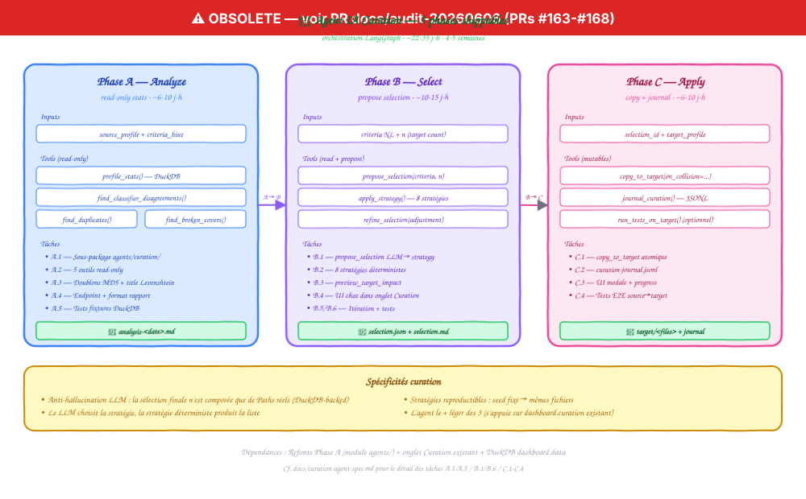

# Spec — Agent IA « Curation de profil »

[← Retour au README](../README.md) · [Spec agent Refonte](refonte-agent-spec.md) · [Spec agent Onboarding](onboarding-agent-spec.md)

> Troisième agent IA du projet Klodo. Aide à **constituer des sous-ensembles de fichiers** d'un profil source vers un profil cible, selon des critères sémantiques que l'agent comprend (échantillon représentatif, doublons, edge cases pour tests de régression, jeu stratifié, etc.).

## Pourquoi un agent

L'onglet **Curation** du dashboard existe déjà ([dashboard/curation.py](../dashboard/curation.py)) : double panneau qui permet de **sélectionner manuellement** des PDFs d'un profil source pour les copier dans un profil cible (typiquement `test`). C'est utile pour constituer des jeux de tests par picking visuel via les thumbnails.

Limite actuelle : **tout est manuel**. Si l'utilisateur veut "20 fichiers représentatifs couvrant toutes les sections", "tous les fichiers qui ont fini dans `Autres`", ou "les 10 fichiers les plus litigieux selon le classifier", il doit le faire à la main.

L'agent curation prend le relais sur les sélections intelligentes :
- **Échantillons stratifiés** sémantiquement (pas juste random — distribution voulue, ex. 3 par section top-level)
- **Détection de doublons** (mêmes contenus rangés sous deux noms / deux catégories)
- **Edge cases** : fichiers où le classifier hésite (score faible, désaccord N1/N2/N3), fichiers en `Autres`, fichiers avec couverture cassée
- **Régression test set** : constitution d'un jeu de tests stable pour valider que les changements de mapping ne dégradent pas la classif
- **Conversation** pour ajuster les critères en cours de route ("ajoute-moi 5 PDFs supplémentaires en Programmation, et retire ceux que tu avais déjà mis qui sont des Cookbooks")

## Hors scope (explicitement)

- **Modification du profil source** — toutes les opérations sont read-only côté source
- **Génération d'annotations / résumés** des fichiers — juste sélection + copie
- **Curation cross-profils en bulk** — un profil source à la fois (pas de fan-out)
- **Renommage ou re-classification** lors de la copie — c'est la responsabilité du profil cible
- **Sélection sur PDFs non analysés par vision** — l'agent travaille sur des fichiers déjà passés par `analyze_cover` (sinon il n'a pas d'info sémantique)

## Architecture cible

<p align="center">
  
</p>

```text
┌──────────────────────────────────────────────────────────────────┐
│              Curation Agent (LangGraph)                          │
│                                                                  │
│   ┌────────────┐    ┌────────────┐    ┌────────────┐             │
│   │ Phase A    │ →  │ Phase B    │ →  │ Phase C    │             │
│   │ Analyze    │    │ Select     │    │ Apply      │             │
│   └────────────┘    └────────────┘    └────────────┘             │
│        ↓ stats         ↓ candidate set  ↓ copy to target         │
└──────────────────────────────────────────────────────────────────┘
        ↓ shared
┌──────────────────────────────────────────────────────────────────┐
│  dashboard.curation        (helpers copie + thumbnails)          │
│  dashboard.data            (DuckDB queries stats)                │
│  lib.classifier            (score / desagreement detection)      │
│  agents/                   (module Python partagé)               │
└──────────────────────────────────────────────────────────────────┘
```

L'agent vit dans `agents/curation/` (sous-package du module `agents/`). Frontend : extension de l'onglet **Curation** existant + endpoints `/api/agent/curation/*`.

---

## Phase A — Analyze (read-only)

### Objectif

L'agent comprend le profil source avant toute sélection. Il produit des **stats** + **anomalies détectées** qui éclairent les choix de curation : si l'utilisateur demande "20 fichiers représentatifs", l'agent doit savoir s'il y a 88 sections ou 5, si la distribution est équilibrée ou déséquilibrée, où sont les zones d'ombre.

### Ce que l'agent analyse

- **Distribution** : nombre de fichiers par section top-level et par sous-dossier (réutilise `dashboard.data` DuckDB)
- **Désaccords classifier** : fichiers où N1 (theme_mapping) et N2 (keyword) ou N3 (LLM) divergeraient s'ils étaient ré-évalués — détectés via le trigger N3 sur catch-all (PR #147) et d'éventuels désaccords inter-niveaux
- **Doublons potentiels** : par hash MD5 head bytes (déjà calculé pour le cache thumbnail) + par similarité de titre (Levenshtein)
- **Couvertures cassées** : fichiers où `vision_cache.json` retourne `theme=""` ou pas d'entrée du tout
- **Anciens** : fichiers analysés avec une version de `PROMPT_VERSION` antérieure à la version courante — candidats à re-vision

### Sortie

`profile/<source>/.cache/curation/analysis-<date>.md` :

```markdown
# Curation Analysis — profil source `default` — 2026-05-25

## Distribution
- 19 259 fichiers répartis sur 88 dossiers / 5 sections top-level
- Section dominante : `02-INFORMATIQUE` (8 240, 43%)
- Section sous-utilisée : `04-ECONOMIE` (240, 1.2%)

## Désaccords classifier (3.2% — 617 fichiers)
- Catch-all hit par N1 mais N3 propose un dossier spécifique : 412 fichiers
- N2 keyword override : 205 fichiers
- (À examiner sur un cas avant régression test)

## Doublons potentiels (78 paires, 156 fichiers)
- 23 paires : même MD5, basenames différents (renames manqués)
- 55 paires : titre similaire (Levenshtein < 4), MD5 différents (vraies variantes)

## Couvertures cassées (8 fichiers)
- 3 PDFs encryptés
- 5 PDFs avec page de garde noire

## Anciens (PROMPT_VERSION < courant : 142 fichiers)
- Cycle 2 vs cycle 3 (avant fix parser 2026-05-04)
```

### Outils nécessaires (read-only)

| Outil | Signature | Effet |
|---|---|---|
| `profile_stats` | `(profile) -> ProfileStats` | Distribution par section/dossier, réutilise queries DuckDB `dashboard.data` |
| `find_classifier_disagreements` | `(profile) -> list[Disagreement]` | Compare N1/N2/N3 sur les fichiers déjà en cache vision |
| `find_duplicates` | `(profile, method="md5"\|"title") -> list[DupeGroup]` | Groupes de fichiers candidats doublons |
| `find_broken_covers` | `(profile) -> list[Path]` | Fichiers où vision_cache vide ou erreur |
| `find_stale_vision` | `(profile, min_version) -> list[Path]` | Fichiers analysés sous PROMPT_VERSION ancien |

### Endpoint

`POST /api/agent/curation/analyze` body :
```json
{
  "source_profile": "default",
  "target_profile": "test",  // déclaré dès Phase A pour contexte
  "criteria_hint": "représentatif global"  // optionnel — guide la profondeur d'analyse
}
```

### Garde-fous Phase A

- **Aucune écriture FS** côté Klodo — seul artefact : `analysis-<date>.md` dans `.cache/curation/`
- **Cap durée** : si l'analyse dépasse 60s (gros profil), retourne un rapport partiel + propose de l'affiner
- **Pas d'accès LLM** en Phase A par défaut (toutes les sources sont locales : DuckDB + vision_cache + MD5). Optionnel : embedding-based duplicate detection si l'utilisateur l'active explicitement (cost contrôlé)

---

## Phase B — Select (proposition de sélection)

### Objectif

À partir d'un critère donné par l'utilisateur en langage naturel, **proposer une liste de fichiers** (rel_paths) avec rationale par fichier. L'utilisateur valide / ajuste / re-prompt avant la copie.

### Exemples de critères supportés

| Critère utilisateur | Stratégie agent |
|---|---|
| "20 fichiers représentatifs de toute la biblio" | Échantillon stratifié par section top-level, poids ∝ √(taille_section) |
| "5 fichiers par section" | Échantillon uniforme stratifié |
| "tous les Autres de Programmation" | Filtre par dossier == catch-all |
| "10 fichiers où le classifier hésite" | Top-10 des désaccords par score gap |
| "les doublons MD5" | Tous les groupes MD5 (1 fichier par groupe = canonical) |
| "10 couvertures à re-visionner" | Couvertures cassées + anciennes (jusqu'à 10) |
| "jeu de régression : 50 fichiers stables, couvrant 10+ sections, sans doublons" | Composition : 50 fichiers, stratifié, exclure doublons MD5, score classifier > 0.6 |

### Sortie

Un fichier JSON dans `.cache/curation/<selection_id>/selection.json` :

```json
{
  "selection_id": "sel-2026-05-25-1234",
  "source_profile": "default",
  "target_profile": "test",
  "criteria": "20 fichiers représentatifs de toute la biblio",
  "strategy": "stratified_topsection",
  "count": 20,
  "files": [
    {
      "rel_path": "02-INFORMATIQUE/03-Langages-Programmation/01-Python/Fluent Python.pdf",
      "section": "02-INFORMATIQUE",
      "rationale": "représentant de Programmation Python (cluster 12% biblio)",
      "score_classifier": 0.92
    },
    ...
  ],
  "diagnostics": {
    "sections_covered": 5,
    "duplicates_excluded": 3,
    "broken_covers_excluded": 0
  }
}
```

Plus un **markdown lisible** `selection.md` pour l'audit humain.

### Outils Phase B (read + propose)

| Outil | Signature | Effet |
|---|---|---|
| Tous ceux de Phase A | | (réutilisés pour cibler la sélection) |
| `propose_selection` | `(profile, criteria, n) -> Selection` | LLM interprète le critère, choisit la stratégie, échantillonne |
| `apply_strategy` | `(strategy, profile, n) -> list[Path]` | Stratégies déterministes : stratified, top_disagreement, duplicates_only, etc. |
| `preview_target_impact` | `(selection, target_profile) -> ImpactReport` | Combien de fichiers déjà présents dans target, collisions, espace requis |
| `refine_selection` | `(selection_id, adjustment) -> Selection` | Modifier une sélection existante ("ajoute 5 Python", "retire les Cookbooks") |

### Itération conversationnelle

```
User: 20 fichiers représentatifs
Agent: J'ai composé une sélection stratifiée :
       - 02-INFORMATIQUE : 9 fichiers (43% biblio)
       - 01-SCIENCES : 5
       - 03-HISTOIRE : 3
       - 05-RELIGIONS : 2
       - 04-ECONOMIE : 1
       Voir selection.md
User: ajoute 3 Cookbooks
Agent: ⚠ Aucun dossier "Cookbook" dans 02-INFORMATIQUE.
       J'ai trouvé 4 fichiers avec "cookbook" dans le titre, dans /Python et /JavaScript.
       Tu veux que j'en pioche 3 sur ces 4 ?
User: oui
Agent: ✓ Sélection mise à jour : 23 fichiers
```

### Garde-fous Phase B

- **Aucune écriture sur target_profile** — uniquement `.cache/curation/<selection_id>/`
- **Validation que tous les rel_paths existent réellement** dans le profil source avant de proposer
- **Diff vs sélection précédente** affiché à chaque itération (added / removed)
- **Limite n ≤ 200** par sélection (au-delà, l'agent demande s'il faut vraiment ou si c'est une erreur)
- **Anti-hallucination LLM** : la liste finale est filtrée par `apply_strategy` qui ne retourne que des Paths réellement listés via DuckDB. Le LLM ne peut pas inventer un rel_path

---

## Phase C — Apply (copie vers target)

### Objectif

Copier physiquement la sélection vers le profil cible avec gestion des collisions et journalisation.

### Exemples de tour de conversation

```
User: applique
Agent: Je vais copier 23 fichiers (124 MB) vers profil 'test' :
       - 21 nouveaux
       - 2 collisions (basename existe déjà) → suffixe -2
       Confirmer ?
User: oui
Agent: ✓ Copie terminée. 23 fichiers écrits.
       Journal : profile/test/.cache/curation-journal.jsonl
       Tu veux que je lance les tests fonctionnels sur 'test' ?
```

### Tools mutables (read + write)

| Outil | Signature | Effet |
|---|---|---|
| Tous ceux de Phase B | | (l'agent peut affiner avant apply) |
| `copy_to_target` | `(selection_id, target_profile, on_collision="suffix"\|"skip"\|"overwrite") -> CopyResult` | Copie physique. Réutilise les helpers de `dashboard.curation` |
| `journal_curation` | `(selection_id, copy_result) -> JournalEntry` | Append à `profile/<target>/.cache/curation-journal.jsonl` |
| `run_tests_on_target` | `(target_profile) -> TestResult` | (optionnel) Lance `tests/functional/runner.py --profile <target>` |

### Journal agent

```json
{
  "ts": "2026-05-25T14:30:00",
  "agent": "curation",
  "phase": "C",
  "action": "copy_to_target",
  "selection_id": "sel-2026-05-25-1234",
  "source": "default",
  "target": "test",
  "criteria": "20 fichiers représentatifs de toute la biblio",
  "files_copied": 21,
  "collisions_resolved": 2,
  "bytes_written": 130023424
}
```

### Garde-fous Phase C

- **Refus si target_profile == source_profile** (no-op et risqué)
- **Refus si target_profile n'existe pas** — l'agent suggère onboarding-agent ou `./klodo.sh init`
- **Dry-run par défaut** — l'agent affiche le plan d'abord, demande confirmation
- **Atomicité par fichier** : chaque copie est atomique (`shutil.copy2 → tempfile → rename`), pas de partial state
- **Journal append-only** — pas de mutation rétroactive
- **Espace disque vérifié** avant la copie (`shutil.disk_usage`) — refus si insuffisant
- **Pas de delete sur source** — Phase C ne supprime jamais rien

---

## Plan de développement

### Vue d'ensemble

| Phase | Effort estimé | Dépendances | Livrable |
|---|---|---|---|
| **A — Analyze** | ~6-10 j-h | Agent Refonte Phase A (module `agents/`) + dashboard.data DuckDB | Analyse + 5 outils read-only |
| **B — Select** | ~10-15 j-h | Phase A + dashboard.curation helpers existants | Sélection conversationnelle + stratégies |
| **C — Apply** | ~6-10 j-h | Phase B + `lib.rename_journal` pattern pour le journal | Copie atomique + journal |
| **Total** | **~22-35 j-h** | Refonte A + dashboard Curation existant | Agent curation livrable en 4-5 semaines |

L'agent curation est le **plus léger des trois** parce qu'il s'appuie sur l'infrastructure dashboard Curation déjà en place.

### Phase A — Tasks détaillées

- **A.1** — Sous-package `agents/curation/` + state typé `CurationState`
- **A.2** — Outils read-only (5) : `profile_stats`, `find_classifier_disagreements`, `find_duplicates`, `find_broken_covers`, `find_stale_vision`. Réutilise queries DuckDB existantes
- **A.3** — Détection de doublons : version "md5 head bytes" (déjà calculé pour thumbnail cache) et version "title Levenshtein"
- **A.4** — Endpoint `POST /api/agent/curation/analyze` + format markdown standardisé
- **A.5** — Tests : ~8 tests sur fixtures DuckDB synthétiques

### Phase B — Tasks détaillées

- **B.1** — Outil `propose_selection` : LLM interprète le critère NL → choisit une stratégie déterministe
- **B.2** — Stratégies (`apply_strategy`) : `stratified_topsection`, `uniform_per_section`, `top_disagreement`, `duplicates_only`, `broken_covers`, `regression_set`, `from_folder`, `by_title_match`
- **B.3** — Outil `preview_target_impact` : intersection avec target_profile, calcul collisions, espace requis
- **B.4** — UI dashboard : extension de l'onglet Curation existant — chat panel à côté du double panneau actuel, sélection auto poppe les fichiers dans le panneau source
- **B.5** — Itération : `refine_selection(adjustment)` qui parse les ajustements NL et compose avec `apply_strategy`
- **B.6** — Tests : ~12 tests dont une suite de stratégies + edge cases (n=0, n=200, target inexistant, collisions)

### Phase C — Tasks détaillées

- **C.1** — Outil `copy_to_target` : wrap autour de `dashboard.curation` helpers existants + on_collision policy
- **C.2** — Journal `curation-journal.jsonl` : format aligné avec rename_journal (append-only, batch_id)
- **C.3** — UI : modale de confirmation avant copie (récap + estimation), barre de progression pendant
- **C.4** — Tests E2E : crée 2 profils test, lance curation 10 fichiers de A vers B, vérifie présence + journal + idempotence

---

## Tests et validation

### Tests unitaires (par tâche)

- **Phase A** : ~8 tests (mocks DuckDB, fixtures profil synthétique)
- **Phase B** : ~12 tests (stratégies, edge cases, refine_selection)
- **Phase C** : ~8 tests (copie atomique, collision policies, refus self-target, journal)

Cible : **~28 tests** ajoutés à `tests/auto/test_agent_curation.py`.

### Tests fonctionnels

- 1 série dans `tests/functional/tests.yaml` : "Curation agent end-to-end" :
  1. Crée 2 profils test (sourceX, targetY) avec 30 fichiers chacun
  2. Lance analyze sur sourceX
  3. Vérifie que l'analyse retourne au moins 2 catégories
  4. Lance select : "5 fichiers représentatifs"
  5. Vérifie que la sélection contient 5 rel_paths existants
  6. Lance apply
  7. Vérifie 5 fichiers présents dans targetY + entrée dans curation-journal.jsonl

### Métriques de succès

| Métrique | Cible v1 |
|---|---|
| Sélection retournée en < 5 sec pour profils < 20k fichiers | ✓ |
| Stratégies déterministes : 100% reproductibles (seed fixe → mêmes fichiers) | ✓ |
| 0 hallucination de rel_path par le LLM | ✓ (filtrage Phase B) |
| Apply atomique : 0 partial-copy en cas de crash mi-copie | ✓ |
| Coût LLM par sélection ≤ $0.10 (interprétation NL + rationale) | ✓ |

---

## Risques identifiés + mitigations

| Risque | Probabilité | Impact | Mitigation |
|---|---|---|---|
| LLM invente un rel_path → erreur lors de l'apply | Élevée (sans précaution) | Critique | Filtrage Phase B : la sélection finale n'est composée que de Paths issus de `apply_strategy` (DuckDB-backed) |
| Stratégie mal choisie pour le critère NL | Moyenne | Mineur | L'agent affiche le nom de la stratégie + count + rationale. User peut re-prompt |
| Critère ambigu (ex. "des trucs intéressants") | Élevée | Mineur | L'agent demande clarification au lieu d'inventer une stratégie |
| Espace disque insuffisant côté target | Faible | Majeur | Check `shutil.disk_usage` avant apply, refus si < 1.2× taille sélection |
| Collisions de basename non gérées | Faible | Mineur | `on_collision` explicite (default `suffix`) |
| Pollution de target_profile avec des fichiers d'agent runs ratés | Moyenne | Mineur | `selection_id` dans le journal → bouton "undo selection" en C.4 (optionnel) |
| Profil source modifié pendant la curation (run concurrent) | Faible | Moyen | Snapshot de la liste de fichiers en début de Phase B. Si un fichier a disparu au moment de l'apply → skip + journal |
| Désaccord N1/N3 mal interprété comme "le classifier hésite" | Faible | Mineur | Doc explicite dans le rationale : "désaccord" = trigger N3 a fired, c'est un signal pas une certitude |

---

## Frameworks alternatifs considérés

Mêmes considérations que pour les agents Refonte et Onboarding. **LangGraph** retenu pour cohérence avec les autres agents. Voir [refonte-agent-spec.md](refonte-agent-spec.md#frameworks-alternatifs-considérés).

Note spécifique curation : la phase de sélection (B) est l'endroit où on aurait pu envisager d'utiliser un système plus simple (pas d'orchestration LangGraph, juste des outils Python). Choix de garder LangGraph pour :
- Itération conversationnelle native (refine_selection en multi-tour)
- Cohérence du state pattern entre les 3 agents
- Pouvoir composer plus tard (refonte + curation, par exemple "régénère le jeu de tests après un changement de mapping")

---

## Glossaire technique

| Terme | Définition |
|---|---|
| **selection_id** | UUID d'une session Phase B, sert de clé pour `.cache/curation/<id>/` |
| **stratégie** | Algorithme déterministe de sélection (stratified, top_disagreement, etc.). Le LLM choisit la stratégie ; la stratégie produit la liste de paths |
| **désaccord classifier** | Cas où N1, N2 ou N3 propose des dossiers différents — utile pour les jeux de régression |
| **régression test set** | Sélection stable destinée à être ré-évaluée après chaque modif de mapping, pour détecter les drifts |
| **on_collision policy** | Comportement quand un basename existe déjà côté target : `suffix` (default, ajoute -2/-3), `skip` (ne copie pas), `overwrite` (remplace) |
| **canonical** | Dans un groupe de doublons, le fichier choisi comme représentant (ex. nom le plus propre) |
