# Tests Fonctionnels & Dashboard — Documentation technique et fonctionnelle

> Version : 1.0 — 10 avril 2026

## Diagrammes

| Diagramme | Description |
|-----------|-------------|
| [Architecture globale](diagrams/testing-architecture-overview.svg) | Les 4 couches : definition, execution, persistance, visualisation |
| [Flux du runner](diagrams/testing-runner-flow.svg) | Execution complete de la commande au rapport DuckDB |
| [Monitoring temps reel](diagrams/testing-realtime-monitoring.svg) | Dashboard ↔ Runner via stdout pipe + polling HTTP |
| [Flux de donnees](diagrams/testing-data-flow.svg) | Comment data.py fusionne 4 sources pour chaque page |
| [Validation manuelle](diagrams/testing-manual-validation.svg) | Cycle de vie SKIP → Oui/Non → Valide → Modifier |
| [Schema DuckDB](diagrams/duckdb-schema.svg) | 4 tables : runs, series_results, check_results, manual_validations |
| [Dependances](diagrams/testing-dependencies.svg) | Systeme provides/requires entre series |
| [Skills Claude Code](diagrams/testing-skills-overview.svg) | Orchestrateur + Skill 1 (generate/update) + Skill 3 |
| [Flux complet](diagrams/testing-full-flow.svg) | Du lancement au dashboard, toutes les etapes |
| [Pages du dashboard](diagrams/testing-dashboard-pages.svg) | 10 pages + API endpoints detailles |

---

## Table des matieres

1. [Vue d'ensemble](#1-vue-densemble)
2. [Architecture generale](#2-architecture-generale)
3. [Le plan de tests (tests.yaml)](#3-le-plan-de-tests)
4. [Le runner (run_functional.py)](#4-le-runner)
5. [Le validateur (validate_tests.py)](#5-le-validateur)
6. [Le backend DuckDB (db.py)](#6-le-backend-duckdb)
7. [Le dashboard](#7-le-dashboard)
8. [Les skills Claude Code](#8-les-skills-claude-code)
9. [Flux de donnees](#9-flux-de-donnees)
10. [Guide operationnel](#10-guide-operationnel)

---

## 1. Vue d'ensemble

### Pourquoi un systeme de tests fonctionnels dedie ?

Klodo utilise des LLMs pour classifier et renommer des PDFs. Ce pipeline est **non-deterministe** par nature : le meme fichier peut recevoir un theme different selon le modele, la temperature, ou le contexte. Les tests unitaires (360+ tests dans `tests/auto/`) verifient que le code fonctionne, mais pas que le **resultat metier** est correct.

Les tests fonctionnels comblent ce gap : ils executent le pipeline reel sur un jeu de donnees controle (taille variable, curee via le dashboard Curation) et verifient que les metriques de qualite (taux de classification, taux de renommage, confiance moyenne) restent dans les seuils acceptables.

### Les pieces du puzzle

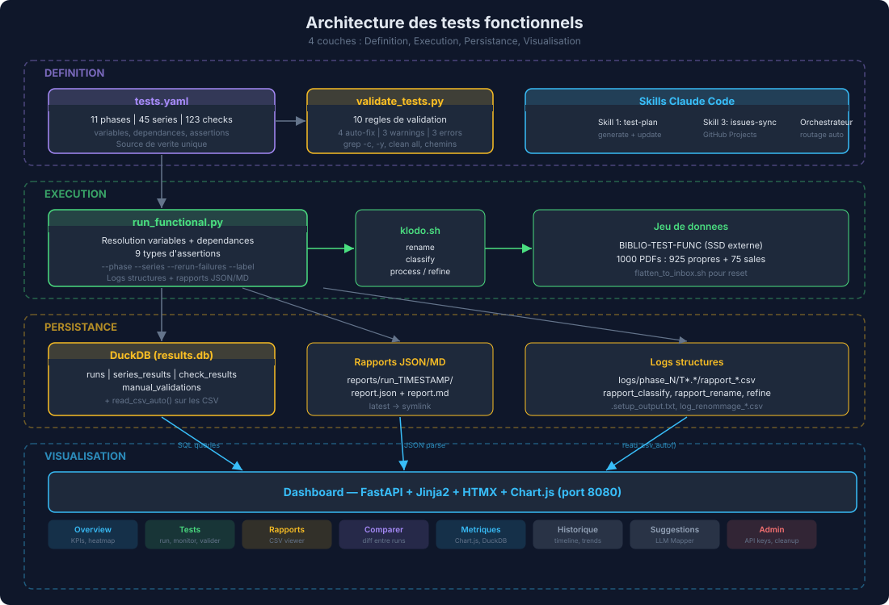

---

## 2. Architecture generale

### Composants et responsabilites

L'architecture est organisee en **4 couches** :

| Couche | Composants | Role |
|--------|-----------|------|
| **Definition** | `tests.yaml`, `validate_tests.py`, Skills Claude Code | Definir et valider le plan de tests |
| **Execution** | `run_functional.py`, `klodo.sh`, jeu de donnees | Executer les tests, capturer les resultats |
| **Persistance** | DuckDB (`results.db`), rapports JSON/MD, logs CSV | Stocker les resultats a long terme |
| **Visualisation** | Dashboard FastAPI + HTMX + Chart.js | Visualiser, comparer, piloter |

### Jeu de donnees de test

- **Emplacement** : `/Volumes/ExtSSD/BIBLIO-TEST-FUNC`
- **Composition** : 1000 PDFs selectionnes
  - 925 fichiers avec noms propres (couverture des 9 sections)
  - 75 fichiers avec noms "sales" (hash, IDs, gibberish)
- **Inventaire** : `tests/fixtures/functional_inventory.yaml` (4131 lignes)
- **Selection** : `tests/fixtures/functional_selection.json` (6002 lignes)

---

## 3. Le plan de tests

### Structure de tests.yaml

Le fichier `tests.yaml` (1779 lignes) est organise ainsi :

| Section | Contenu |
|---------|---------|
| `version` | "1.0" |
| `variables` | Chemins parametrables (`KLODO`, `BIBLIO_TEST`, `INBOX`, `PROF`, etc.) avec refs chainees (`${BIBLIO_TEST}/_INBOX`) |
| `session` | Setup/teardown globaux (flatten + clean progress) |
| `phases` | 11 phases progressives (prerequis → performance) |
| `custom` | Tests manuels (jamais ecrases par les skills) |

**Phases :**

| Phase | Nom | Series |
|-------|-----|--------|
| 0 | Prerequis et smoke tests | 4 |
| 1 | Renommage | 5 |
| 2 | Classification basique | 5 |
| 3 | Classification avancee | 5 |
| 4 | Pipeline complet (process) | 5 |
| 5 | Raffinement | 3 |
| 6 | Securite et edge cases | 6 |
| 7 | Suggestions et gestion erreurs | 3 |
| 8 | Idempotence et reprise | 3 |
| 9 | Nettoyage et maintenance | 3 |
| 10 | Performance et stabilite | 4 |

### Anatomie d'une serie

```yaml
- id: T2.1
  name: "Classify dry-run"
  description: "Verifie que classify fonctionne en mode dry-run"
  github_issue: 91
  provides: [classify_works]
  requires: [env_ready]
  pre_run:
    - ${FLATTEN} ${BIBLIO_TEST} --execute 2>&1
  setup:
    - ${KLODO} classify ${INBOX} --profile ${PROF} --max 30 -y 2>&1
  checks:
    - id: T2.1a
      description: "Le rapport CSV est genere"
      command: "ls -t ${LOGS}/rapport_classify_*.csv | head -1"
      assert:
        type: file_exists
        pattern: ${LOGS}/rapport_classify_*.csv
      mode: auto
```

### Types d'assertions (9)

| Type | Comportement |
|------|-------------|
| `exit_code` | Code retour == expected (defaut: 0) |
| `output_equals` | stdout (trimme) == expected |
| `output_contains` | stdout contient TOUS les strings |
| `output_not_contains` | stdout ne contient AUCUN string |
| `file_exists` | Au moins 1 fichier matche le glob |
| `file_not_exists` | Aucun fichier ne matche |
| `line_count` | Nb lignes du fichier vs seuil |
| `manual_check` | Validation humaine (SKIP en auto) |
| `duration_under` | Temps d'execution < N secondes |

### Systeme de dependances

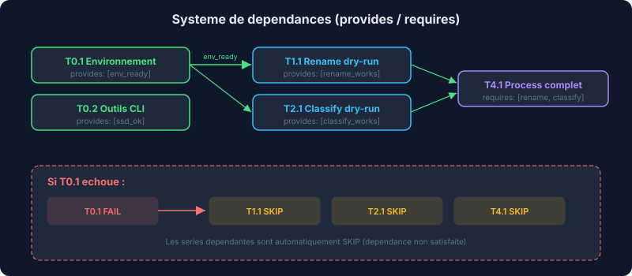

---

## 4. Le runner

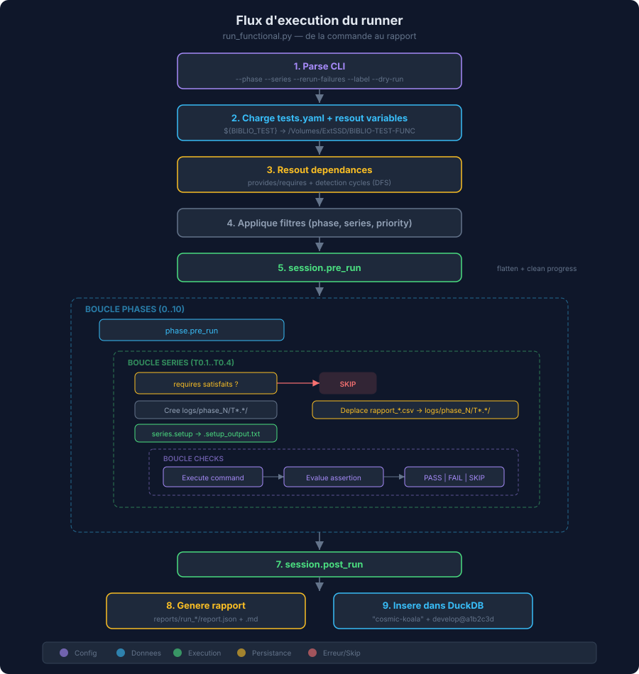

### Arguments CLI

```bash
uv run python tests/functional/run_functional.py \
    [--interactive]         # Mode step-by-step + validation manuelle
    [--phase 0 1 2]         # Filtrer par phases
    [--series T2.1 T2.3]    # Filtrer par series
    [--priority obligatoire] # Filtrer par priorite
    [--var PROF=prod]       # Surcharger des variables
    [--dry-run]             # Afficher le plan sans executer
    [--rerun-failures]      # Relancer les FAIL + SKIP du dernier run
    [--no-history]          # Ne pas inserer dans DuckDB
    [--label "mon-test"]    # Nom custom (sinon: random adjective-noun)
```

### Structure des logs

Les logs sont organises par phase et serie :

| Chemin | Contenu |
|--------|---------|
| `logs/phase_N/T*.*/` | Repertoire par serie |
| `.setup_output.txt` | Stdout capture du setup |
| `rapport_rename_*.csv` | Rapport de renommage Klodo |
| `rapport_classify_*.csv` | Rapport de classification Klodo |
| `log_renommage_*.csv` | Log detaille du renommage |

Les rapports finaux sont dans `reports/run_TIMESTAMP/report.json` + `report.md`, avec un symlink `latest` vers le dernier run.

---

## 5. Le validateur

### Les 10 regles

| # | Regle | Type | Description |
|---|-------|------|-------------|
| 1 | `grep_c_echo` | Auto-fix | `grep -c \|\| echo 0` produit un double output |
| 2 | `grep_c_chain` | Auto-fix | `)&&grep -c` → `); grep -c` |
| 3 | `missing_yes` | Auto-fix | classify/process sans `-y` |
| 4 | `clean_all` | Auto-fix | `clean all` → `clean progress` |
| 5 | `absolute_paths` | Warning | `/Users`, `/Volumes` en dur |
| 6 | `blocking_commands` | Warning | `read -p`, `input()` interactif |
| 7 | `dependencies` | Warning | requires non satisfaits |
| 8 | `yaml_structure` | Erreur | Champs requis manquants |
| 9 | `paths_exist` | Erreur | Chemins inexistants |
| 10 | `report_names` | Erreur | Noms CSV non standard |

### Utilisation

```bash
uv run python scripts/validate_tests.py          # Verifier seulement
uv run python scripts/validate_tests.py --fix    # Verifier + corriger
uv run python scripts/validate_tests.py --json   # Sortie JSON
```

---

## 6. Le backend DuckDB

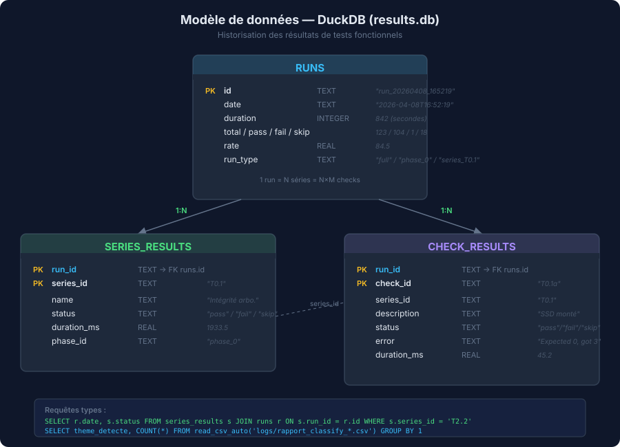

### Fonctions cles

| Fonction | Description |
|----------|-------------|
| `insert_run(report, run_id, run_type, label)` | Insere un run complet (phases/series/checks) |
| `get_runs(limit=50)` | Liste les runs tries par date DESC |
| `get_run_detail(run_id)` | Reconstruit un rapport complet depuis la DB |
| `get_series_history(series_id)` | Historique d'une serie sur N runs |
| `get_check_history(check_id)` | Historique d'un check sur N runs |
| `get_failing_series(min_fails=2)` | Series qui echouent souvent |
| `validate_check(run_id, check_id, status)` | Validation manuelle depuis le dashboard |
| `query_csv(pattern, sql)` | Query SQL directe sur des CSV via `read_csv_auto()` |
| `generate_run_name()` | Genere "adjective-noun" aleatoire |
| `get_git_info()` | Detecte branche + commit courant |

### Nommage des runs

Les runs recoivent un nom aleatoire memorable : `cosmic-koala`, `turbo-tiramisu`, `quantum-phoenix`, `swift-vibranium`, `epic-gandalf`, `zen-cappuccino`.

---

## 7. Le dashboard

### Stack technique

| Composant | Technologie |
|-----------|-------------|
| Backend | FastAPI + Uvicorn (single worker) |
| Templates | Jinja2 |
| Interactivite | HTMX + vanilla JS |
| Graphiques | Chart.js v4.4 |
| Theme | Dark (CSS custom, pas de framework) |
| Donnees | DuckDB + JSON + CSV + YAML |
| Port | 8080 |

### Pages et routes

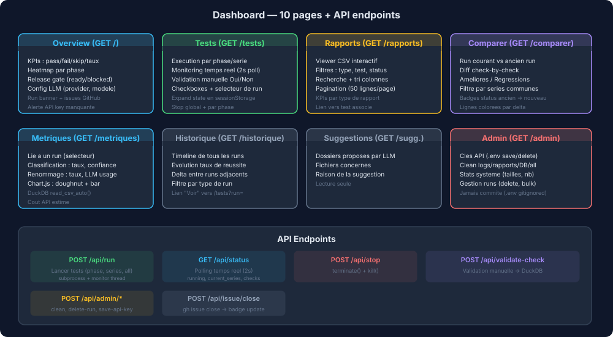

### Monitoring temps reel

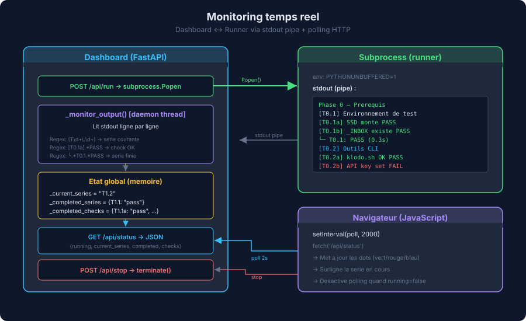

### Couche donnees (data.py)

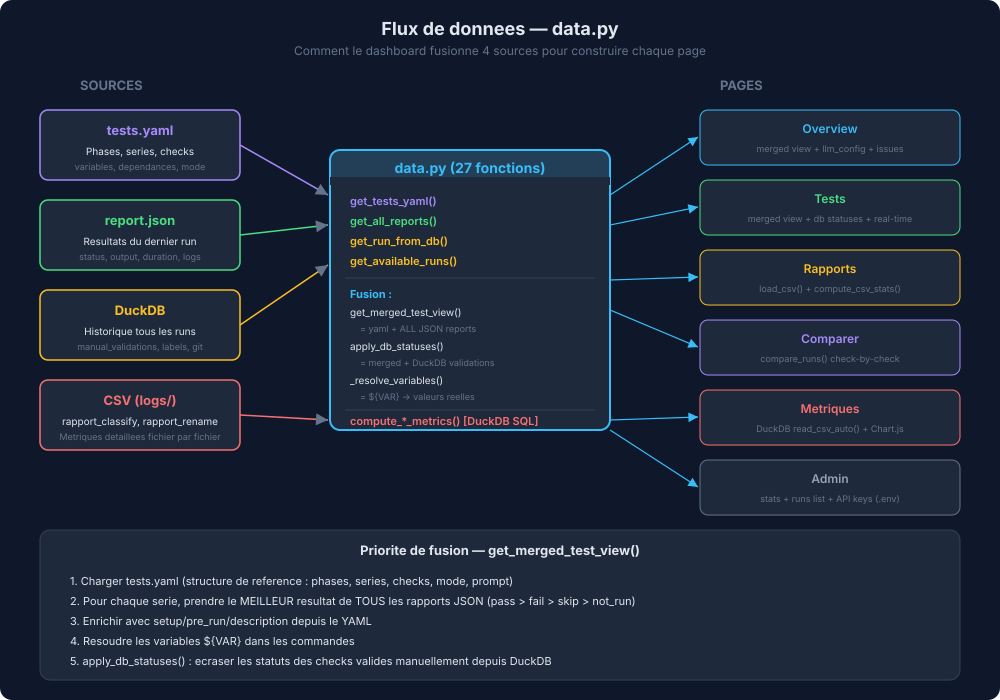

### Validation manuelle — cycle de vie

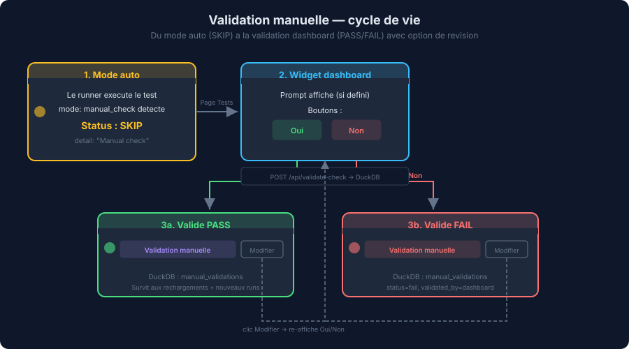

### Onglet Curation — viewer double panneau

L'onglet **Curation** (`/viewer`) permet de constituer des jeux de tests sur mesure par copie selective de fichiers entre profils. Layout en deux panneaux empiles :

- **Source (haut)** — Lecture seule, accepte tous les profils (default, test, test-local). Liste filtrable, navigateur de pages, bouton `+` a droite de chaque fichier pour le marquer.
- **Destination (bas)** — Bride a `test` et `test-local` uniquement (validation cote serveur ET UI). Recoit les fichiers copies. Selecteur "Pages 1-4" dans le header pour controler combien de pages sont generees.

**Operations** :

- **Copier selection (N) → destination** : `POST /api/viewer/copy` avec validation path traversal et profil destination
- **Vider destination** : supprime les `.pdf`/`.epub` mais **preserve** `.thumbnail-cache/`
- **Generer manquants** : complete chaque fichier jusqu'a N pages (option B)
- **Regenerer tout** (source uniquement) : vide complement et regenere page 1
- **Vider cache** : supprime tout le contenu de `.thumbnail-cache/` (sous-dossiers + legacy `.jpg` a plat)

**Cache structure** : `{INBOX}/.thumbnail-cache/{stem}/{1..n}.jpg` (un sous-dossier par document, avec une image par page numérotée).

**Generation parallele** : `ProcessPoolExecutor` avec 4 workers (`_THUMBNAIL_BATCH_WORKERS = 4` dans `dashboard/app.py`) — vrai parallelisme CPU pour `pdf2image` qui contourne le GIL Python.

**Progress bar inline** : sous le header de chaque panneau, bleue pendant la generation puis verte avec "✓ Termine" via SSE (`/api/viewer/events`).

**Formats supportes** : PDF (via `lib/vision.py:extract_cover_image` + Poppler) et ePub (parsing manifest OPF via `zipfile` stdlib, supporte ePub 2 et 3). Les autres formats produisent un placeholder.

**Mockup statique** : `/viewer-mockup` reste accessible comme reference visuelle (bandeau "Mockup non fonctionnel").

### Onglet Logs — viewer des rapports utilisateur

L'onglet **Logs** (`/logs`) affiche les rapports CSV utilisateur dans `logs/` (rapport_rename, rapport_classify, rapport_process, refine). Filtre par type, recherche par nom, tri colonnes, pagination 50 lignes/page. Path traversal protege via `_is_safe_file_path()`.

### Gestion des cles API

La cle API est geree via la page Admin :

1. **Saisie** dans le dashboard → `POST /api/admin/save-api-key`
2. **Sauvegarde** dans `.env` (gitignored, jamais commite)
3. **Runtime** : `os.environ` mis a jour immediatement
4. **klodo.sh** source `.env` au demarrage (`set -a; source .env; set +a`)
5. **Overview** affiche le statut : provider, modele, cout/appel, cle configuree ou manquante

---

## 8. Les skills Claude Code

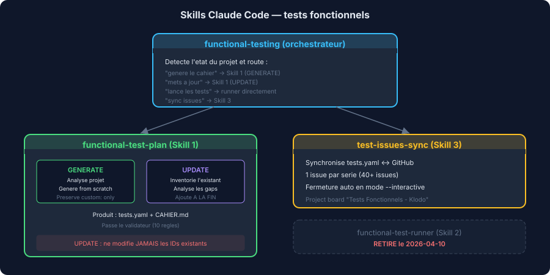

### Skill 2 (functional-test-runner) — RETIRE

Le Skill 2 generait `run_functional.py` automatiquement. Il a ete retire le 2026-04-10 car le runner est devenu du code mature maintenu manuellement (DuckDB, logs structures, monitoring temps reel, runs nommes). Relancer le skill aurait ecrase toutes ces ameliorations.

---

## 9. Flux de donnees

### Flux complet d'un run de tests

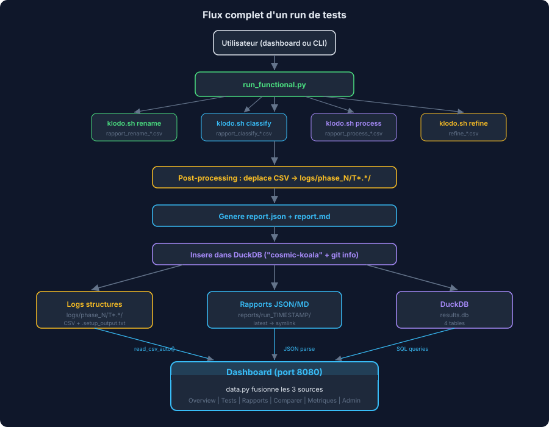

---

## 10. Guide operationnel

### Lancer le dashboard

```bash
uv run python -m dashboard.app          # http://127.0.0.1:8080
uv run python -m dashboard.app 9000     # port custom
```

### Lancer les tests

```bash
# Tout lancer
uv run python tests/functional/run_functional.py

# Une phase
uv run python tests/functional/run_functional.py --phase 1

# Des series specifiques
uv run python tests/functional/run_functional.py --series T2.1 T2.3

# Relancer les echecs
uv run python tests/functional/run_functional.py --rerun-failures

# Dry-run (voir le plan sans executer)
uv run python tests/functional/run_functional.py --dry-run

# Run nomme sans historisation
uv run python tests/functional/run_functional.py --label "test-rapide" --no-history
```

### Valider le plan de tests

```bash
uv run python scripts/validate_tests.py          # Verifier
uv run python scripts/validate_tests.py --fix    # Verifier + corriger
```

### Remettre a zero le jeu de donnees

```bash
echo oui | ./scripts/flatten_to_inbox.sh /Volumes/ExtSSD/BIBLIO-TEST-FUNC --execute
```

Le script effectue deux etapes :

1. **Restauration des noms originaux** via `scripts/restore_original_names.py` — Lit les `logs/log_renommage_*.csv` produits par `rename --execute` et renomme chaque PDF vers son nom d'origine. Permet de garder un jeu de test reproductible entre les runs.
2. **Deplacement vers _INBOX** — Tous les PDFs (hors _INBOX) sont deplaces vers `_INBOX/` avec gestion des collisions (suffixe numerique).

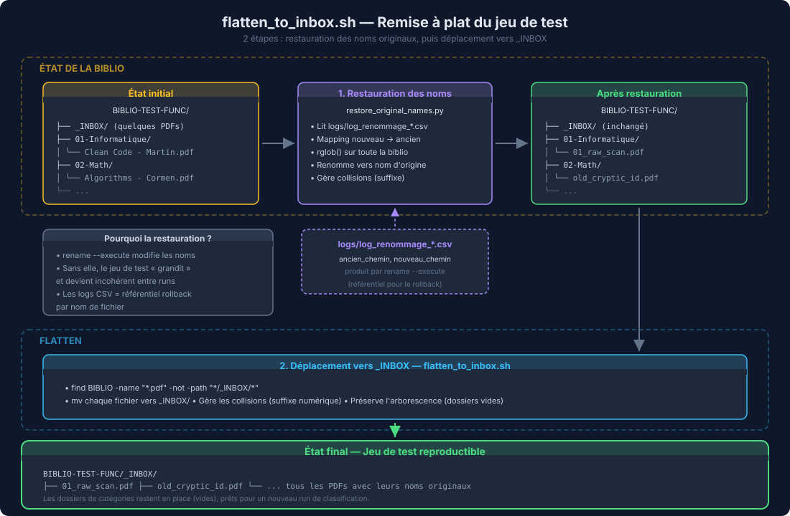

Sans la restauration, `rename --execute` altererait progressivement le jeu de test (les fichiers renommes garderaient leurs nouveaux noms au prochain run).

### Configurer la cle API

Deux methodes :
1. **Dashboard** : Admin → Cles API → saisir et sauvegarder
2. **CLI** : `echo "SILICONFLOW_API_KEY=sk-xxx" >> .env`

### Arborescence complete

| Chemin | Role |
|--------|------|
| `tests/functional/tests.yaml` | Source de verite (11 phases, 45 series, 123 checks) |
| `tests/functional/CAHIER_TESTS_FONCTIONNELS.md` | Vue Markdown generee |
| `tests/functional/run_functional.py` | Runner (code maintenu manuellement) |
| `tests/functional/db.py` | Backend DuckDB |
| `tests/functional/results.db` | Base de donnees (gitignored) |
| `tests/functional/logs/` | Logs structures par phase/serie (gitignored) |
| `tests/functional/reports/` | Rapports par run (gitignored) |
| `dashboard/__main__.py` | Point d'entree (uvicorn, port 8080) |
| `dashboard/app.py` | Routes FastAPI + monitoring temps reel + SSE + ProcessPool thumbnails |
| `dashboard/data.py` | Couche donnees (fusion YAML+JSON+DuckDB+CSV + helpers viewer) |
| `dashboard/static/style.css` | Dark theme + composants viewer + progress bar inline |
| `dashboard/static/js/` | Modules JS extraits : common, validation, filters, tests, admin, viewer |
| `dashboard/templates/` | 12+ templates dont macros reutilisables (`macros/widgets.html`) |
