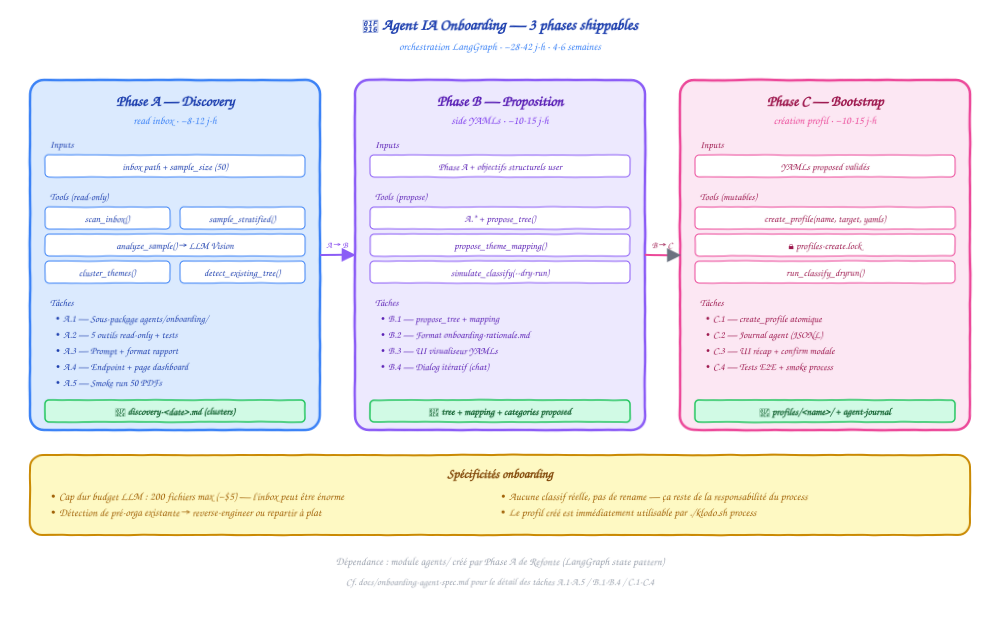

# Spec — Agent IA « Onboarding nouveau profil »

[← Retour au README](../README.md) · [Spec agent Refonte](refonte-agent-spec.md) · [Spec agent Curation](curation-agent-spec.md)

> Second agent IA du projet Klodo. Lit ce qui se trouve dans un dossier "inbox" et propose une **taxonomie de départ** (tree.yaml + theme_mapping.yaml + categories.yaml) adaptée au contenu réel, plutôt que de forcer l'utilisateur à tout écrire à la main.

## Pourquoi un agent

Aujourd'hui, créer un profil = `./klodo.sh init <nom> --target /path` puis **éditer 3 YAMLs à la main** avant de pouvoir classer quoi que ce soit. Problème chicken-and-egg : on ne sait pas écrire un bon `theme_mapping.yaml` avant de connaître les thèmes qui vont sortir du vision LLM sur le corpus.

L'agent onboarding casse ce blocage : il **échantillonne** le contenu, **groupe** les thèmes par cluster sémantique, et **propose** une taxonomie de départ que l'utilisateur valide ou ajuste. Le profil ainsi créé est immédiatement utilisable par `./klodo.sh process`.

Ce qu'un agent apporte (vs. script déterministe) :
- **Compréhension sémantique des clusters** : "Programmation Java", "Programmation Python", "Frameworks JS" → cluster `02-INFORMATIQUE/03-Langages-Programmation/` avec sous-dossiers, pas un fourre-tout
- **Conversation pour les choix structurels** : "tu préfères grouper par langage ou par paradigme ?"
- **Détection de profil pré-organisé** : si le dossier source contient déjà une structure (`Sciences/`, `Programmation/`), l'agent propose de la reverse-engineer plutôt que de reconstruire

## Hors scope (explicitement)

- **Renommage des fichiers** — l'agent ne touche pas aux noms (c'est `./klodo.sh rename` après création du profil)
- **Classification réelle** — l'agent ne déplace pas les PDFs. Il crée le profil. La classification se fait après via `./klodo.sh process`
- **Auto-discover continu** — one-shot pour le bootstrap. Pour enrichir la taxonomie après coup → agent Refonte
- **Génération de prompts custom** — utilise les prompts vision standards de Klodo
- **Multi-profils en parallèle** — un onboarding = un profil à la fois (pas de bulk)

## Architecture cible

<p align="center">
  
</p>

```text
┌──────────────────────────────────────────────────────────────────┐
│              Onboarding Agent (LangGraph)                        │
│                                                                  │
│   ┌────────────┐    ┌────────────┐    ┌────────────┐             │
│   │ Phase A    │ →  │ Phase B    │ →  │ Phase C    │             │
│   │ Discovery  │    │ Proposition│    │ Bootstrap  │             │
│   └────────────┘    └────────────┘    └────────────┘             │
│        ↓ read inbox     ↓ side YAMLs    ↓ create profile         │
└──────────────────────────────────────────────────────────────────┘
        ↓ shared with Refonte agent (read tools)
┌──────────────────────────────────────────────────────────────────┐
│  lib.vision.analyze_cover      (échantillon LLM Vision)          │
│  lib.classifier (read-only)    (validation des propositions)     │
│  lib.profile.create_profile    (mutation finale)                 │
│  agents/                       (module Python partagé)           │
└──────────────────────────────────────────────────────────────────┘
```

L'agent vit dans `agents/onboarding/` (sous-package du module `agents/` créé par Refonte). Frontend : nouvel onglet **Onboarding** dans le dashboard + endpoints `/api/agent/onboarding/*`.

---

## Phase A — Discovery (read-only)

### Objectif

L'agent observe l'inbox sans rien modifier. Il échantillonne intelligemment, identifie les clusters de contenu et produit un **rapport de découverte** que l'utilisateur lit pour comprendre ce que Klodo a vu dans son corpus avant d'engager la suite.

### Ce que l'agent discovere

- **Volume + format** : nombre de fichiers, répartition PDF/ePub/autres
- **Pré-organisation existante** : structure de dossiers détectée dans l'inbox (s'il y en a une)
- **Échantillon stratifié** : N fichiers (default N=50, configurable jusqu'à 200) répartis sur l'arborescence existante ou aléatoirement si flat
- **Thèmes bruts** : appel LLM Vision sur l'échantillon, agrégation des `theme` et `themes[]`
- **Clusters proposés** : regroupement des thèmes par proximité sémantique (similarité d'embeddings ou règles déterministes)
- **Cas non couverts** : fichiers où le LLM retourne `theme=""` ou couverture non extractible — signalés

### Sortie

Un fichier markdown auto-généré : `profile/<name>/.cache/discovery-<date>.md`

```markdown
# Discovery — inbox `/Volumes/ExtSSD/MyBooks` — 2026-05-25

## Volume
- 1 247 fichiers (1 198 PDF · 49 ePub)
- Taille moyenne : 8 MB · range [40 KB → 220 MB]

## Pré-organisation détectée
✅ L'inbox a déjà une structure :
  - `Books/Programming/` (412 files)
  - `Books/Science/` (218 files)
  - `Books/History/` (87 files)
  - `Books/Misc/` (530 files)

Recommandation : reverse-engineer la structure existante + analyse de `Misc/` pour proposer des sous-dossiers.

## Échantillon analysé (50 fichiers)
- Stratifié sur les 4 dossiers principaux
- Coût LLM : $0.74 · durée : 4 min

## Clusters détectés
1. **Langages de programmation** (412 fichiers, 33%)
   - Java (~120) · Python (~90) · JavaScript (~70) · C/C++ (~50) · Autres (~80)
2. **Sciences exactes** (218 fichiers, 17%)
   - Mathématiques (~80) · Physique (~70) · Chimie (~30) · Biologie (~38)
3. **Histoire** (87 fichiers, 7%)
   - XXe siècle (~40) · Antiquité (~25) · Médiéval (~22)
4. **Religion / Spiritualité** (62 fichiers, 5%, inferred from Misc)
5. **Économie / Finance** (48 fichiers, 4%, inferred from Misc)
6. **Cas non couverts** : 8 fichiers (LLM theme vide ou couverture illisible)
```

### Outils nécessaires (read-only)

| Outil | Signature | Effet |
|---|---|---|
| `scan_inbox` | `(path) -> InboxStats` | Compte fichiers, formats, structure de dossiers |
| `sample_stratified` | `(inbox, n=50, strategy="balanced") -> list[Path]` | Échantillonnage proportionnel à l'arbo, ou aléatoire si flat |
| `analyze_sample` | `(paths) -> list[VisionResult]` | Appelle `lib.vision.analyze_cover` sur chaque, retourne titre+thème+themes |
| `cluster_themes` | `(vision_results) -> list[ThemeCluster]` | Regroupe par proximité — règles + embeddings optionnels |
| `detect_existing_tree` | `(inbox) -> TreeStructure \| None` | Inspecte la profondeur/régularité de l'arbo. Retourne None si flat |

### Endpoint

`POST /api/agent/onboarding/discovery` body :
```json
{
  "inbox_path": "/Volumes/ExtSSD/MyBooks",
  "profile_name": "perso-2026",  // pré-réservé, profil pas encore créé
  "sample_size": 50
}
```
Retourne le rapport markdown + un `discovery_id` pour la Phase B.

### Garde-fous Phase A

- **Aucune écriture FS** côté Klodo. La seule "écriture" est le rapport markdown dans `.cache/onboarding/<discovery_id>/`
- **Cap budget LLM** : par défaut, $5 max par discovery (200 fichiers × $0.025). Au-delà, l'agent s'arrête et demande confirmation
- **Aucun accès à la biblio classifiée existante** d'autres profils (sauf si l'utilisateur l'autorise pour s'inspirer)
- **Pas de download** : tous les outils opèrent sur le FS local

---

## Phase B — Proposition (side YAMLs)

### Objectif

À partir du rapport Phase A + des objectifs structurels de l'utilisateur (conversation), produire 3 YAMLs **proposés**, sans toucher au système. L'utilisateur les visualise, simule la classif, ajuste.

### Ce que l'agent produit

3 fichiers dans `profile/<name>/.cache/onboarding/<discovery_id>/proposed/` :
- `tree-proposed.yaml` — arborescence cible (sections top-level + sous-dossiers)
- `theme-mapping-proposed.yaml` — mapping thème → dossier basé sur les clusters Phase A
- `categories-proposed.yaml` — mots-clés par dossier (fallback KeywordClassifier)

Plus :
- `onboarding-rationale.md` — décisions structurelles (pourquoi 4 sections top-level, pourquoi tel cluster va dans tel dossier)

### Format `onboarding-rationale.md`

```markdown
# Onboarding — profil `perso-2026` — 2026-05-25

## Structure top-level proposée (5 sections)

1. **01-INFORMATIQUE** (33%, 412 files)
2. **02-SCIENCES** (17%, 218 files)
3. **03-HISTOIRE** (7%, 87 files)
4. **04-RELIGIONS** (5%, 62 files)
5. **05-AUTRES** (38%, 468 files non clusterisés)

Rationale : sections top-level basées sur les 5 clusters dominants. Le dossier 05-AUTRES capture le résiduel — il sera affiné via l'agent Refonte après quelques runs de classify.

## Sous-arbo détaillée

```yaml
01-INFORMATIQUE:
  01-Langages-Programmation:
    01-Java: {}
    02-Python: {}
    03-JavaScript: {}
    04-C-Cpp: {}
    Autres: {}
  02-Frameworks: {}
  03-Bases-Donnees: {}
```

## Theme mapping initial (32 entrées)

```yaml
"java programming": 01-INFORMATIQUE/01-Langages-Programmation/01-Java
"python programming": 01-INFORMATIQUE/01-Langages-Programmation/02-Python
...
```

## Simulation dry-run

Si on lance `./klodo.sh process /Volumes/ExtSSD/MyBooks` avec ces YAMLs :
- ~78% des fichiers iraient dans une catégorie spécifique (pas dans Autres)
- ~22% iraient dans le bucket `Autres` (à raffiner)
- 8 fichiers non identifiables (cf. Phase A)
```

### Outils Phase B (read + propose)

| Outil | Signature | Effet |
|---|---|---|
| Tous ceux de Phase A | | (réutilisés pour itération) |
| `propose_tree` | `(clusters, depth=2) -> TreeYaml` | Génère tree.yaml depuis les clusters |
| `propose_theme_mapping` | `(vision_results, tree) -> ThemeMappingYaml` | Mappe chaque thème détecté vers un dossier de tree |
| `propose_categories` | `(clusters, vision_titles) -> CategoriesYaml` | Extrait mots-clés représentatifs par cluster |
| `simulate_classify` | `(inbox, proposed_yamls) -> ClassifySimulation` | Dry-run de classify avec les YAMLs proposés, retourne distribution + cas catch-all |
| `inspire_from_profile` | `(other_profile_name) -> TreePattern` | (optionnel) Lit un profil existant pour s'inspirer des conventions |

### Itération

L'agent dialogue : "Voici 5 sections top-level. Tu veux fusionner Religion et Spiritualité ? Tu préfères grouper par langage ou par paradigme dans Programmation ?"

Chaque ajustement re-génère les YAMLs proposés et la simulation. Le rationale est mis à jour pour tracer les décisions.

### Garde-fous Phase B

- **Aucune mutation hors `.cache/onboarding/<discovery_id>/`** — le dossier `profile/<name>/` réel n'existe pas encore
- **Simulation requise avant Phase C** : l'agent refuse d'entrer en Phase C si la dernière `simulate_classify` montre > 50% catch-all ou < 100 fichiers classés
- **Pas d'écriture de mappings hallucinés** : chaque entrée `theme_mapping-proposed.yaml` doit provenir d'un `theme` réellement observé en Phase A
- **Snapshot avant Phase C** : copie des proposed YAMLs sous `.cache/onboarding/<discovery_id>/snapshot-before-bootstrap.tar` pour audit

---

## Phase C — Bootstrap (création du profil)

### Objectif

Créer **le profil pour de vrai** sur le FS Klodo : `profiles/<name>/profile.yaml`, `tree.yaml`, `theme_mapping.yaml`, `categories.yaml` à partir des YAMLs proposés validés. Optionnellement, lance un premier classify pour amorcer l'auto-apprentissage.

### Exemples de tour de conversation

```
User: lance le bootstrap
Agent: Je vais créer le profil 'perso-2026' avec :
       - target : /Volumes/ExtSSD/MyBooks
       - 5 sections, 32 mappings, ~50 mots-clés categories
       - LLM : SiliconFlow (défaut)
       Confirmer ?
User: oui
Agent: ✓ Profil créé. Je peux lancer un dry-run de process maintenant ?
User: vas-y
Agent: [Lance ./klodo.sh process /Volumes/ExtSSD/MyBooks --dry-run]
       → 974/1247 classés (78%)
       → 265 dans Autres (à raffiner)
       → 8 erreurs (couverture illisible)
       Tu veux que je relance avec --execute ?
User: pas encore, je veux d'abord regarder les 265 Autres
```

### Tools mutables (read + write)

| Outil | Signature | Effet |
|---|---|---|
| Tous ceux de Phase B | | (l'agent peut re-itérer si l'utilisateur ajuste) |
| `create_profile` | `(name, target, proposed_yamls) -> ProfileResult` | Écrit `profiles/<name>/` avec les 4 YAMLs validés + `.cache/` initial |
| `lock_for_create` | `(name) -> Lock` | `profiles-create.lock` — empêche 2 onboardings concurrents sur le même nom |
| `run_classify_dryrun` | `(profile, inbox) -> ClassifyResult` | Wrap autour de `commands/process.py --dry-run` |
| `run_classify_execute` | `(profile, inbox) -> ClassifyResult` | Idem mais `--execute`. Garde-fou : confirmation explicite user requise |

### Journal agent

Toute action Phase C est journalisée dans `profile/<name>/.cache/agent-journal.jsonl` :
```json
{"ts": "...", "agent": "onboarding", "phase": "C", "action": "create_profile", "name": "perso-2026", "target": "/Volumes/ExtSSD/MyBooks", "files_created": ["profile.yaml", "tree.yaml", ...]}
```

### Garde-fous Phase C

- **Refus de créer un profil dont le nom existe déjà** — l'agent propose un suffix `-2` ou demande de choisir un autre nom
- **Refus si la target n'existe pas ou n'est pas un dossier** — validation `os.path.isdir()` avant tout
- **Refus si target == target d'un autre profil** (concurrence read/write impossible à gérer) — l'agent demande à l'utilisateur de désambiguïser
- **Validation YAML** : `yaml.safe_load()` sur chaque proposed YAML avant écriture. Refus si parse échoue
- **Journal append-only** : pas de mutation rétroactive du journal
- **Atomicité** : écriture des 4 YAMLs dans un répertoire temporaire puis `os.rename()` atomique vers `profiles/<name>/`

---

## Plan de développement

### Vue d'ensemble

| Phase | Effort estimé | Dépendances | Livrable |
|---|---|---|---|
| **A — Discovery** | ~8-12 j-h | Agent Refonte Phase A (module `agents/` créé) | Rapport discovery + 5 outils read-only |
| **B — Proposition** | ~10-15 j-h | Phase A + Agent Refonte Phase B (pattern propose) | Proposed YAMLs + simulation |
| **C — Bootstrap** | ~10-15 j-h | Phase B + dashboard UI nouveau | Création profil + UI complète |
| **Total** | **~28-42 j-h** | Refonte A+B (dépendances dures) | Agent onboarding livrable en 4-6 semaines |

### Phase A — Tasks détaillées

- **A.1** — Extension du module `agents/` créé par Refonte. Sous-package `agents/onboarding/` avec state typé `OnboardingState`.
- **A.2** — Outils read-only (5) : `scan_inbox`, `sample_stratified`, `analyze_sample`, `cluster_themes`, `detect_existing_tree`. Tests unitaires sur fixtures (mocks vision pour `analyze_sample`).
- **A.3** — Prompt agent Phase A. Format de rapport markdown standardisé.
- **A.4** — Endpoint FastAPI `POST /api/agent/onboarding/discovery` + page dashboard `/onboarding`.
- **A.5** — Smoke run sur un inbox de test (50 PDFs réels). Coût < $1, durée < 5 min.

### Phase B — Tasks détaillées

- **B.1** — Outils propose (4) : `propose_tree`, `propose_theme_mapping`, `propose_categories`, `simulate_classify`. Réutilisation maximale de `lib.classifier` en read-only.
- **B.2** — Format `onboarding-rationale.md` + générateur depuis l'état de l'agent.
- **B.3** — UI dashboard : visualiseur des YAMLs proposés (tree.yaml expandable, theme_mapping searchable), bouton "Simulate" qui appelle `simulate_classify`.
- **B.4** — Itération conversationnelle : interface chat dans le dashboard, chaque message ré-invoque l'agent qui ajuste les proposed YAMLs.

### Phase C — Tasks détaillées

- **C.1** — Outil `create_profile` : utilise `lib.profile` existant (déjà testé par `./klodo.sh init`). Wrap autour avec validation + lock.
- **C.2** — Journal `.cache/agent-journal.jsonl`. Format aligné avec celui de Refonte Phase C.
- **C.3** — UI Phase C : page récap pré-création (affiche les 4 YAMLs, target, options), bouton "Créer le profil" avec confirmation modale.
- **C.4** — Tests E2E : créer profil de test, vérifier qu'il est immédiatement utilisable par `./klodo.sh process --dry-run` sans erreur.

---

## Tests et validation

### Tests unitaires (par tâche)

- **Phase A** : ~12 tests (mocks vision, fixtures inbox synthétique avec pré-orga / sans pré-orga / mixte)
- **Phase B** : ~15 tests (génération YAML, simulation classify, edge cases : 0 cluster, 50 clusters, themes vides)
- **Phase C** : ~10 tests (création atomique, refus collision nom, refus target inexistante, journal append)

Cible : **~37 tests** ajoutés à `tests/auto/test_agent_onboarding.py`.

### Tests fonctionnels

- 1 série dans `tests/functional/tests.yaml` : "Onboarding agent end-to-end" qui :
  1. Crée un dossier test avec 20 PDFs réels
  2. Lance discovery
  3. Vérifie que le rapport contient au moins 2 clusters
  4. Lance proposition
  5. Vérifie que les YAMLs proposés sont parsables
  6. Lance bootstrap
  7. Vérifie que `profiles/test-onboarding/` existe et que `./klodo.sh process --profile test-onboarding --dry-run` ne crashe pas

### Métriques de succès

| Métrique | Cible v1 |
|---|---|
| Profil créé en < 15 min total (discovery + dialog + bootstrap) | ✓ |
| ≥ 70% des fichiers classés à la 1re passe de `process` post-bootstrap | ✓ |
| ≤ 30% dans le bucket `Autres` post-bootstrap | ✓ |
| Coût LLM total par onboarding ≤ $3 (échantillon 50 fichiers) | ✓ |
| 0 corruption profil sur 100 onboardings consécutifs | ✓ |

---

## Risques identifiés + mitigations

| Risque | Probabilité | Impact | Mitigation |
|---|---|---|---|
| Échantillon non représentatif → taxonomie biaisée | Moyenne | Majeur | Échantillonnage stratifié + warning si l'inbox est très hétérogène (variance élevée des clusters) |
| Coût vision explose sur grosse inbox | Faible | Moyen | Cap dur à 200 fichiers échantillonnés. Si l'utilisateur veut plus, prompt explicite avec estimation $$$ |
| Sur-spécialisation : 50 sous-dossiers pour un cluster | Moyenne | Moyen | Limite profondeur à 2 niveaux en Phase B. L'agent Refonte enrichira après |
| Profil créé incompatible avec format Klodo | Faible | Critique | Validation `lib.profile.validate()` (existant) avant écriture |
| Concurrence : 2 onboardings simultanés même nom | Faible | Mineur | `profiles-create.lock` simple |
| L'utilisateur abandonne en cours de dialog → état `.cache/onboarding/<id>/` orphelin | Élevée | Mineur | TTL 7 jours sur `.cache/onboarding/`. Nettoyage via `klodo clean onboarding-cache` |
| Mauvaise détection de pré-orga existante (faux positif) | Moyenne | Moyen | Toujours montrer la structure détectée + bouton "ignorer la pré-orga" pour repartir à plat |
| Inbox = SSD externe non monté au moment de bootstrap | Moyenne | Mineur | Vérification de la target au moment de `create_profile`, pas seulement Phase A |

---

## Frameworks alternatifs considérés

Mêmes considérations que pour l'agent Refonte. **LangGraph** retenu pour :
- Cohérence avec le 1er agent (1 framework, 1 state pattern)
- Bonne abstraction pour les phases shippables séparément

Voir [refonte-agent-spec.md](refonte-agent-spec.md#frameworks-alternatifs-considérés) pour le détail.

---

## Glossaire technique

| Terme | Définition |
|---|---|
| **inbox** | Dossier source brut, avant onboarding |
| **discovery_id** | UUID d'une session de Phase A, sert de clé pour `.cache/onboarding/<id>/` |
| **cluster** | Groupe de thèmes détectés par vision qui partagent une proximité sémantique (ex : "java programming", "java spring" → cluster Java) |
| **proposed YAML** | YAML généré en Phase B, jamais lu par Klodo en production. Sert uniquement à la simulation et au dialogue |
| **bootstrap** | Acte de matérialiser les proposed YAMLs en vrai profil Klodo (Phase C) |
| **stratifié** | Échantillonnage qui respecte la distribution des sous-dossiers (si pré-orga détectée) ou des extensions/tailles (si flat) |
