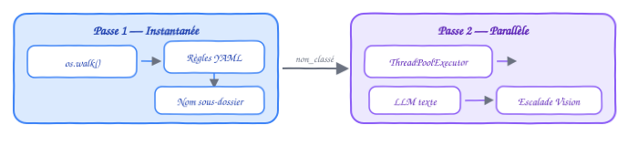

# Raffinement

[← Retour au README](../README.md) · [Architecture](architecture.md)

## Vue d'ensemble

Le raffinement est la dernière étape du pipeline. Il parcourt récursivement l'arborescence de la bibliothèque et détecte les fichiers mal placés : un PDF qui se trouve dans un dossier parent alors qu'il devrait être dans un sous-dossier plus spécifique.

**Principe** : si un dossier contient à la fois des fichiers PDF et des sous-dossiers, alors les PDF ne sont pas dans un dossier feuille et sont candidats au raffinement.

<p align="center">
  
</p>

## Les 4 niveaux de matching

### Niveau 1 : Règles YAML

Matching par mots-clés explicites définis dans `refinement.yaml`. Chaque règle associe un dossier parent, un sous-dossier cible, et une liste de mots-clés.

```yaml
# Extrait de refinement.yaml
- parent: 02-INFORMATIQUE/05-IA-ML
  target: Deep-Learning
  keywords: [neural, cnn, rnn, deep learning, tensorflow, pytorch, keras]

- parent: 01-SCIENCES/PHYSIQUE
  target: Optique
  keywords: [light, laser, optics, photon, optical]
```

Les règles sont triées par spécificité (le chemin parent le plus long est testé en premier).

### Niveau 2 : Nom de sous-dossier

Si aucune règle YAML ne matche, les noms des sous-dossiers existants sont utilisés comme mots-clés implicites. Le nom est normalisé en plusieurs variantes :

```
"Deep-Learning" → ["deep-learning", "deep learning", "deeplearning"]
"05-IA-ML"      → ["ia-ml", "ia ml", "iaml"]
```

Les variantes de ≤2 caractères sont ignorées pour éviter les faux positifs.

### Niveau 3 : LLM texte (optionnel, `--llm`)

Pour les fichiers restants, un appel LLM texte envoie au modèle le nom du fichier, le dossier actuel, et **uniquement les sous-dossiers disponibles à ce niveau** (pas toute l'arborescence). Le LLM choisit le meilleur sous-dossier ou répond `_AUCUN`.

Le fait de scoper le prompt localement est important : le LLM ne voit que les sous-dossiers du dossier courant, ce qui l'empêche de devenir un second classifieur global. Par exemple, un fichier dans `02-INFORMATIQUE/` ne verra que `[Fondamentaux, Algo, Langages, IA-ML, ...]`, pas les dossiers de `01-SCIENCES/`.

```
Entrée envoyée au LLM :
  - Fichier : "Introduction_Machine_Learning_Bishop.pdf"
  - Dossier actuel : 02-INFORMATIQUE
  - Sous-dossiers : [01-Fondamentaux, 02-Algo, 03-Langages, 04-Systemes,
                      05-IA-ML, 06-Data-Science, ...]

Réponse attendue :
  {"folder": "05-IA-ML", "confidence": 0.90, "reason": "machine learning = IA/ML"}
```

Le résultat est validé : le dossier retourné doit exister parmi les sous-dossiers listés, et la confiance doit dépasser `min_confidence` (défaut 0.6). Les réponses `_AUCUN` sont conservatrices — mieux vaut laisser un fichier mal placé que le déplacer au mauvais endroit.

**Configuration** : `max_tokens: 150`, `temperature: 0.1`, timeout 20s, 3 tentatives en cas d'erreur 429.

### Niveau 4 : Escalade Vision (optionnel, `--vision`)

Si le LLM texte renvoie `_AUCUN` (souvent parce que le nom du fichier est un ISBN ou un hash qui ne dit rien), la couverture du PDF est extraite, convertie en base64, et envoyée au modèle de vision avec le même prompt enrichi d'un payload multimodal. Le LLM peut ainsi lire le titre et le sujet directement sur la couverture.

Le prompt vision est identique au prompt texte (même dossier actuel, mêmes sous-dossiers), mais inclut l'image de la couverture en plus du nom du fichier. La validation est la même : dossier exact, confiance suffisante.

```
978-3-030-12345-6.pdf
  → LLM texte : _AUCUN (le nom ne dit rien)
  → 👁 Vision : la couverture montre "Neural Networks"
  → Classé dans Deep-Learning/ ✓
```

**Configuration** : `max_tokens: 150`, `temperature: 0.1`, timeout 30s (plus long que le texte car l'image est plus lourde).

## Architecture deux passes

Le traitement est organisé en deux passes pour optimiser les performances :

<p align="center">
  
</p>

La **Passe 1** est instantanée (matching par mots-clés et noms de dossiers). La **Passe 2** traite les fichiers restants en parallèle via `ThreadPoolExecutor` avec `--workers N` threads.

## Barre de progression

Pendant la Passe 2, une barre de progression s'affiche en temps réel :

```
🤖 ████████████░░░░░░░░░░░░░ 142/3296 (4.3%) | ✓ 98 classés | 👁 12 vision | ✗ 32 non_classés | ⏱ 12min | 2.1/s
```

Elle montre l'avancement, le nombre de classés, les escalades vision, les non-classés, l'ETA estimée, et la vitesse de traitement. Le compteur est thread-safe.

## Traçabilité CSV

Chaque run génère un rapport CSV horodaté dans `logs/` avec les colonnes :

| Colonne | Valeurs possibles |
|---|---|
| `fichier` | Nom du PDF |
| `source` | Chemin source relatif |
| `destination` | Chemin cible relatif (vide si non_classé) |
| `mot_cle` | Mot-clé ayant déclenché le match |
| `source_match` | `règle_yaml`, `nom_dossier`, `llm`, `llm_vision`, ou vide |
| `status` | `à_déplacer`, `déplacé`, `déjà_présent`, `non_classé`, `erreur` |

## Commande CLI

```bash
# Dry-run sur toute la bibliothèque
./klodo.sh refine

# Appliquer les déplacements
./klodo.sh refine --execute

# Ajouter le LLM fallback pour les non-classés
./klodo.sh refine --llm --execute

# Ajouter l'escalade vision pour les cas difficiles
./klodo.sh refine --llm --vision --execute

# Paralléliser avec 10 threads
./klodo.sh refine --llm --vision --execute --workers 10

# Test limité avec détails
./klodo.sh refine --llm --vision --max 20 --verbose
```

### Options

| Option | Description |
|---|---|
| `--llm` | Activer le fallback LLM (Niveau 3) |
| `--vision` | Activer l'escalade vision (Niveau 4, requiert `--llm`) |
| ~~`--api-key`~~ | Supprimé — utiliser la variable `SILICONFLOW_API_KEY` |
| `--max N` | Limiter les appels LLM à N fichiers |
| `-w N`, `--workers N` | Threads parallèles (défaut: 1) |

## Module

**Fichier** : `lib/refiner.py`

Fonctions principales :
- `scan_and_refine()` — Orchestration deux passes
- `match_keywords()` — Matching règles YAML
- `match_subdirs()` — Matching implicite par nom de dossier
- `make_refine_llm_callback()` — Construction du callback LLM + vision
- `save_refine_report()` — Export CSV horodaté
- `print_refine_summary()` — Résumé console
