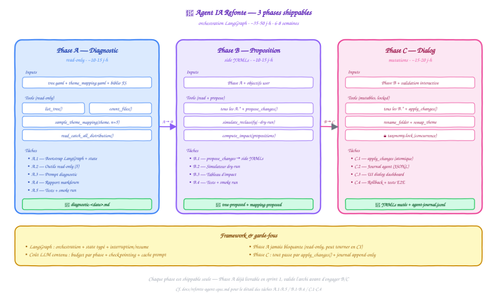

# Spec — Agent IA « Refonte de taxonomie »

[← Retour au README](../README.md) · [Architecture](architecture.md) · [Classification](classification.md)

> **Statut** : spec en cours de validation · décomposition en 3 phases shippables (A → B → C).
> **Audience** : devs Klodo + futurs contributeurs sur la couche agent.

---

## Pourquoi un agent

Klodo dispose aujourd'hui d'une cascade de classification **déterministe et rapide** (cf. [classification.md](classification.md)). Elle résout ~99 % des fichiers correctement après auto-apprentissage. Ce n'est PAS ce qu'on cherche à remplacer.

Ce qu'on cherche à résoudre : trois usages **haut-niveau, créatifs, conversationnels** où la cascade actuelle est inadaptée parce qu'ils demandent du raisonnement multi-étapes avec mémoire et itération :

1. **Refonte de taxonomie** (cette spec) — *"regarde ma biblio existante, propose-moi une arborescence améliorée."*
2. **Onboarding nouveau profil** (spec à venir) — *"j'ai un dossier de 500 PDF inconnus, bootstrap un profil propre."*
3. **Curation interactive** (spec à venir) — *"aide-moi à reviewer ces 200 fichiers non classifiés un par un."*

Les trois agents partagent **les mêmes outils sous-jacents** (theme_mapping, classify_combined, vision_cache, tree.yaml, categories.yaml). Construire l'agent refonte en premier produit ~80 % du scaffolding pour les deux autres.

## Hors scope (explicitement)

- **Classification de masse fichier-par-fichier** — la cascade actuelle est ×30-100 plus rapide et économique. Aucun agent ne fera mieux.
- **Remplacement du pipeline** — l'agent **utilise** les briques existantes via outils ; il ne les réécrit pas.
- **Modification automatique sans validation humaine** — chaque mutation passe par une étape "review + accept" explicite.

## Architecture cible

<p align="center">
  
</p>

```text
┌──────────────────────────────────────────────────────────────────┐
│                    Refonte Agent (LangGraph)                     │
│                                                                  │
│   ┌────────────┐    ┌────────────┐    ┌────────────┐             │
│   │ Phase A    │ →  │ Phase B    │ →  │ Phase C    │             │
│   │ Diagnostic │    │ Proposition│    │ Dialog     │             │
│   └────────────┘    └────────────┘    └────────────┘             │
│        ↓ read-only      ↓ read+yaml      ↓ conversational        │
└──────────────────────────────────────────────────────────────────┘
        ↓ shared tools (read/write)
┌──────────────────────────────────────────────────────────────────┐
│  lib.classifier.classify_combined  (sans LLM Mapper en lecture)  │
│  dashboard.taxonomy.build_snapshot                               │
│  dashboard.reclassify.reclassify_dryrun                          │
│  lib.rename_journal     (journal des actions agent)              │
│  profile/.cache/*       (snapshots, backups, taxonomy.lock)      │
└──────────────────────────────────────────────────────────────────┘
```

L'agent vit dans `agents/` (nouveau module Python). Frontend : nouvel onglet **Refonte** dans Taxonomie + endpoints `/api/agent/refonte/*`.

---

## Phase A — Diagnostic (read-only)

### Objectif

L'agent analyse la taxonomy existante d'un profil et produit un **rapport** lisible d'anomalies. **Aucune mutation YAML.** L'utilisateur lit, comprend, valide la pertinence avant d'autoriser la suite.

### Ce que l'agent diagnostique

- **Dossiers sous-utilisés** (< 5 fichiers) → candidats à fusion
- **Dossiers sur-utilisés** (> 200 fichiers) → candidats à scission
- **Thèmes ambigus** (mappés vers plusieurs sections incompatibles)
- **Doublons sémantiques** (`/AI` et `/Machine-Learning` côte à côte)
- **Sections déséquilibrées** (profondeur 1 vs 4 niveaux dans la même section)
- **Catch-all qui débordent** (où `/Autres` collecte > 30 fichiers — signal qu'un sous-dossier manque)
- **Couverture vision_cache** (% de fichiers avec metadata exploitable, par section)
- **Auto-learning theme_mapping** (combien d'entrées apprises vs curées manuellement)

### Sortie

Rapport markdown structuré dans `profile/.cache/refonte/diagnostic-<ts>.md` :

```markdown
# Diagnostic taxonomy — profil `default` — 2026-05-24

## Stats globales
- 18 425 fichiers · 88 dossiers · profondeur moy. 2.7
- Couverture LLM : 99 % (18 237 / 18 425)

## Anomalies détectées (par priorité)
### Sous-utilisés (8 dossiers)
- `/01-SCIENCES/EPISTEMOLOGIE` (3 fichiers) — fusion avec `/04-SHS/PHILOSOPHIE` ?
- ...

### Catch-all qui débordent (2 candidats)
- `/02-INFORMATIQUE/03-Langages/Autres` (47 fichiers) — vu ~10 Java + 8 C++ + 5 Go isolés
- ...

### Doublons sémantiques (1)
- `/02-INFORMATIQUE/05-IA-ML/Machine-Learning` et `/02-INFORMATIQUE/05-IA-ML/Deep-Learning` — chevauchement de 60 % des thèmes mappés
```

### Outils nécessaires (read-only)

| Outil | Source | Rôle |
|---|---|---|
| `list_folders(profile)` | `tree.yaml` | Énumération |
| `count_files_per_folder(profile)` | `os.walk(target)` | Stats utilisation |
| `read_theme_mapping(profile)` | `theme_mapping.yaml` | Thèmes mappés |
| `read_categories(profile)` | `categories.yaml` | Mots-clés |
| `list_themes_per_folder(profile)` | `vision_cache.json` | Thèmes LLM observés |
| `compute_folder_overlap(folder_a, folder_b)` | combinaison | Détection doublons |

### Endpoint

`POST /api/agent/refonte/diagnostic` body `{profile}` → kick-off async. `GET /api/agent/refonte/diagnostic/<run_id>` → status (pending/running/done) + lien vers le rapport.

### Garde-fous Phase A

- Lecture seule absolue (aucune écriture sur les YAML / FS).
- Idempotent : 2 runs sur le même état produisent le même rapport.
- Stockage du rapport hors git (`.cache/`) — pas de pollution.
- Coût LLM borné : ≤ 5 appels (l'agent peut résumer mais ne fait pas un appel par fichier).

---

## Phase B — Proposition (read + nouveau YAML séparé)

### Objectif

À partir du diagnostic, l'agent **propose une nouvelle taxonomy** sous forme d'un fichier `tree-proposed.yaml` + `theme_mapping-proposed.yaml` séparés. L'utilisateur peut **comparer** (diff visuel) et **simuler l'impact** via `reclassify_dryrun` avant de décider quoi que ce soit.

### Ce que l'agent produit

1. **`tree-proposed.yaml`** — arborescence proposée
2. **`theme_mapping-proposed.yaml`** — mapping enrichi pour matcher la nouvelle arborescence
3. **`refonte-rationale.md`** — explication par changement (créations, fusions, renommages, scissions)
4. **`reclassify-projection.csv`** — pour chaque fichier de la biblio actuelle, où il irait avec la nouvelle taxonomy

### Format `refonte-rationale.md`

```markdown
## Changements proposés

### CRÉATIONS (3)
- `/02-INFORMATIQUE/03-Langages/Java` — récupère 14 fichiers Java actuellement dans /Autres
- `/02-INFORMATIQUE/03-Langages/C-Cpp` — récupère 8 fichiers C++
- ...

### FUSIONS (1)
- `/04-SHS/PHILOSOPHIE` + `/01-SCIENCES/EPISTEMOLOGIE` → `/04-SHS/PHILOSOPHIE-EPISTEMOLOGIE`
  Raison : 3 fichiers chacun, themes très proches (philosophie de la science)

### RENOMMAGES (0)

### MAPPINGS AJOUTÉS (12)
- `Java I/O` → `/02-INFORMATIQUE/03-Langages/Java`
- ...
```

### Comparaison + simulation

L'UI affiche :

- **Diff visuel** entre `tree.yaml` actuel et `tree-proposed.yaml` (ajouts vert, suppressions rouge, fusions orange)
- **Histogramme avant/après** : nombre de fichiers par dossier
- **Reclassify projection** : combien de fichiers bougent, combien restent, combien vont vers les nouveaux dossiers

### Itération

L'utilisateur peut demander : *"j'aime A mais pas la fusion B"*. L'agent regenère une proposition révisée. Conservation de l'historique des propositions (versionnage interne `.cache/refonte/proposals/v1/`, `v2/`, etc.).

### Garde-fous Phase B

- **Aucune mutation des YAML de production** — tout reste dans `.cache/refonte/proposals/<run_id>/`
- **Lock concurrence** : `taxonomy.lock` empêche un baseline_run pendant la génération
- **Reclassify projection en dry-run uniquement** — pas de move FS
- Coût LLM borné : ≤ 30 appels (raisonnement + itérations)

---

## Phase C — Dialog (conversational + commits)

### Objectif

Conversation continue où l'agent peut **appliquer les changements** validés sur les YAML de production. Chaque mutation passe par une étape "preview + confirm". L'agent peut aussi proposer des **micro-actions** de manière interactive (renommer une section, absorber un sous-dossier, etc.).

### Exemples de tour de conversation

> **User** — Crée la section `/02-INFORMATIQUE/03-Langages/Rust`
> **Agent** — Voilà la proposition de mutation :
>   - `tree.yaml` : ajout de la ligne `02-INFORMATIQUE/03-Langages/Rust`
>   - `theme_mapping.yaml` : ajout de `Rust: 02-INFORMATIQUE/03-Langages/Rust`
>   - 3 fichiers candidats pour migrer ici (cf. preview ↓)
>   Confirmer ? [Apply / Skip / Modify]

> **User** — Apply
> **Agent** — Backup créé (`taxonomy-backups/2026-05-24-14h30/`). Mutation appliquée. Reclassify dry-run lancé en arrière-plan.

### Tools mutables (read + write)

| Outil | Effet |
|---|---|
| `add_folder(path)` | Ajoute dans `tree.yaml` + crée le dossier physique |
| `merge_folders(src_paths, dest_path)` | Renomme + déplace fichiers + supprime sources |
| `rename_folder(old, new)` | Renomme physique + tree.yaml + remappe les thèmes |
| `add_theme_mapping(theme, path)` | Ajoute dans `theme_mapping.yaml` |
| `bulk_move_files(rel_paths, dest_folder)` | Wrap de `taxonomy.move_file` (impact preview obligatoire) |

### Journal agent

Toutes les actions sont écrites dans `profile/.cache/refonte/agent-journal.jsonl` (même pattern que `rename-journal.jsonl`). Chaque entrée :

- `ts`, `tool_called`, `args`, `result`, `human_validated: true/false`
- Permet undo, audit, et bootstrap d'un futur "rejouer la session sur un autre profil"

### Garde-fous Phase C

- **Backup automatique** avant chaque mutation (rotation 50)
- **Confirmation humaine obligatoire** par mutation (pas de mode auto)
- **Lock concurrence** `taxonomy.lock` actif pendant l'exécution
- **Limitation des appels LLM par tour** (≤ 5 par message utilisateur)
- **Rollback en 1 clic** depuis le dashboard (réutilise les backups existants)

---

## Plan de développement

### Vue d'ensemble

| Phase | Durée estimée | Livrables |
|---|---|---|
| **A — Diagnostic** | ~10-15 j-h | endpoint + agent LangGraph + 6 outils read-only + rapport markdown + UI minimal |
| **B — Proposition** | ~10-15 j-h | YAML séparés + diff visuel + reclassify projection + itération + UI complète |
| **C — Dialog** | ~15-20 j-h | conversation continue + 5 outils mutables + journal + backup + rollback |

**Total : ~35-50 j-h** sur ~6-8 semaines avec validation à chaque palier.

### Phase A — Tasks détaillées

**A.1 — Scaffolding LangGraph** *(2-3 j)*

- [ ] Nouveau module `agents/` avec `agents/refonte/` (séparé de `lib/` pour clarté)
- [ ] Dépendance `langgraph` ajoutée à `pyproject.toml`
- [ ] Pattern de construction d'agent (ToolNode, conditional edges, state schema)
- [ ] Tests unitaires de base (mock LLM, vérifier le graphe se construit)
- [ ] Décision : modèle LLM par défaut pour l'agent (probablement Sonnet via Anthropic — Qwen3-VL est trop limité pour le raisonnement structuré)

**A.2 — Tools read-only** *(3-4 j)*

- [ ] `list_folders(profile)` — wraps `taxonomy._load_tree`
- [ ] `count_files_per_folder(profile)` — wraps `taxonomy._scan_folder_counts`
- [ ] `read_theme_mapping(profile)` — wraps `taxonomy._load_mapping`
- [ ] `list_themes_per_folder(profile, folder)` — agrégation par folder à partir de `vision_cache.json`
- [ ] `compute_folder_overlap(folder_a, folder_b)` — Jaccard sur les thèmes mappés
- [ ] `get_classifier_breakdown(profile)` — % via N1 / N2 / N3 / FAILED sur le dernier reclassify
- [ ] Tests unitaires pour chaque tool (isolation, données mockées)

**A.3 — Agent diagnostic** *(2-3 j)*

- [ ] State schema : profile, current_step, accumulated_findings
- [ ] Prompt système : *"tu es un assistant qui analyse la taxonomy d'une biblio Klodo et identifie les anomalies"*
- [ ] Graphe : `start → list_anomalies → categorize → write_report → end`
- [ ] Détection systématique des 7 catégories d'anomalies listées plus haut
- [ ] Budget LLM borné à 5 appels max par run
- [ ] Sortie : markdown structuré + JSON parsable

**A.4 — Endpoint + UI** *(3-4 j)*

- [ ] `POST /api/agent/refonte/diagnostic` (kick async)
- [ ] `GET /api/agent/refonte/diagnostic/<run_id>` (status + résultat)
- [ ] Nouvel onglet **Refonte** dans Taxonomie (col 1 statut runs, col 2 rapport courant)
- [ ] Stream du markdown via SSE pendant la génération
- [ ] Tests endpoint + smoke test E2E

**A.5 — Validation + ship** *(1-2 j)*

- [ ] Smoke run sur profil `default` (18k fichiers) — coût estimé : <$1
- [ ] Review du rapport produit avec l'utilisateur
- [ ] Itérations sur les prompts si besoin
- [ ] PR vers `develop`

### Phase B — Tasks détaillées

**B.1 — Tools de proposition** *(2-3 j)*

- [ ] `propose_tree_change(action, args)` — produit un YAML diffable, ne touche pas la prod
- [ ] `simulate_reclassify(proposed_tree, proposed_mapping)` — wraps `reclassify_dryrun` sur les YAML proposés
- [ ] `compute_diff(current, proposed)` — diff structuré pour l'UI
- [ ] `version_proposal(run_id, version, payload)` — versioning dans `.cache/refonte/proposals/`

**B.2 — Agent proposition** *(3-4 j)*

- [ ] Reprend le state de la Phase A (diagnostic en entrée)
- [ ] Graphe : `read_diagnostic → propose_creations → propose_merges → propose_renamings → validate_consistency → write_proposal`
- [ ] Validation interne : cohérence du nouveau tree (pas de cycles, pas de mappings vers des folders inexistants)
- [ ] Génération du `rationale.md`
- [ ] Budget LLM : ≤ 30 appels (raisonnement + plusieurs itérations possibles)

**B.3 — UI diff + simulation** *(4-5 j)*

- [ ] Diff visuel tree.yaml ↔ tree-proposed.yaml (ajouts/suppressions/renommages colorés)
- [ ] Histogramme avant/après (nb fichiers par dossier)
- [ ] Table de projection reclassify (rel_path | from | to | confidence)
- [ ] Bouton "Itérer" : input texte pour demander des ajustements
- [ ] Stockage des versions visibles dans une dropdown (v1, v2, v3...)

**B.4 — Tests + ship** *(1-2 j)*

- [ ] Tests unitaires sur tools de proposition
- [ ] Smoke run sur profil `default` post-diagnostic
- [ ] Review humaine de 2-3 propositions
- [ ] PR vers `develop`

### Phase C — Tasks détaillées

**C.1 — Tools mutables** *(3-4 j)*

- [ ] `add_folder(profile, path)` — wraps `taxonomy.create_folder` + backup
- [ ] `merge_folders(profile, src_paths, dest_path)` — orchestration : créer dest, move files, drop src
- [ ] `rename_folder(profile, old, new)` — wraps `taxonomy.rename_folder` + remap des thèmes affectés
- [ ] `add_theme_mapping(profile, theme, path)` — wraps `taxonomy.upsert_mapping`
- [ ] `bulk_move_files(profile, rel_paths, dest_folder)` — wraps `taxonomy.move_file` en boucle, impact preview obligatoire avant commit
- [ ] Tests pour chaque outil + tests d'intégration sur les enchaînements

**C.2 — Agent conversationnel** *(4-5 j)*

- [ ] Mémoire conversationnelle (LangGraph checkpointer + persistance JSON)
- [ ] Graphe : `parse_user_intent → propose_mutation → preview → wait_confirmation → execute_or_skip`
- [ ] Génération de preview pour chaque mutation avant exécution
- [ ] Streaming des réponses (SSE)
- [ ] Budget par tour : ≤ 5 appels LLM, mutation ≤ 1 par tour

**C.3 — Journal + backup + rollback** *(3-4 j)*

- [ ] `agent-journal.jsonl` append-only (même pattern que rename-journal)
- [ ] Backup auto avant chaque mutation (rotation 50)
- [ ] Endpoint `POST /api/agent/refonte/rollback` (revert à un snapshot)
- [ ] UI : timeline des actions + bouton rollback par action

**C.4 — UI chat + ship** *(4-5 j)*

- [ ] Onglet **Refonte** finalisé : col 1 historique runs, col 2 chat, col 3 timeline mutations
- [ ] Markdown rendering dans la conversation
- [ ] Boutons d'action (Apply / Skip / Modify) inline dans les messages
- [ ] Tests E2E
- [ ] PR vers `develop`

## Tests et validation

| Phase | Tests unitaires | Tests d'intégration | Validation manuelle |
|---|---|---|---|
| A | Tools read-only + agent state | Endpoint + UI rendering | Diagnostic sur profil `default` |
| B | Tools propose + validate | Proposal → simulate → diff | Comparer 2 versions de propositions |
| C | Tools mutables + journal | Conversation E2E | Sessions de 30 min sur profil `test` |

## Métriques de succès

**Phase A**

- Rapport diagnostic produit en < 60 s pour 18k fichiers
- 0 false positive sur les anomalies déclarées (validation humaine sur les 10 premières)
- Coût < $0.50 par run

**Phase B**

- Proposition cohérente (pas de cycles, pas de mappings cassés) : 100 % par construction
- Itérations utiles : au moins 50 % des propositions itérées améliorent la précédente (mesuré sur 10 sessions test)
- Coût < $2 par proposition

**Phase C**

- 0 corruption YAML observée sur 100 mutations
- Rollback fonctionnel en < 10 s
- Coût < $0.20 par tour de conversation

## Risques identifiés + mitigations

| Risque | Probabilité | Impact | Mitigation |
|---|---|---|---|
| Context LLM saturé sur 18k fichiers + 88 dossiers | élevée | majeur | Pré-agrégation (n'envoie pas la liste brute mais des stats résumées) + summarization récursive |
| Hallucinations sur la proposition | moyenne | majeur | Validation structurelle obligatoire (cycles, mappings cassés) + diff visuel + revue humaine systématique |
| Coût LLM dérape (le user explore beaucoup) | moyenne | mineur | Budget appel/tour hard-codé + compteur visible UI + warning > $1/session |
| Rollback YAML race-condition avec un classify en cours | faible | critique | Lock `taxonomy.lock` partagé (existe déjà) + refus de rollback si lock acquis |
| Agent répond bullshit poliment (mode complaisance) | élevée | majeur | Prompt système strict : *"si tu n'as pas les données, dis 'je ne sais pas' — interdiction de spéculer"* + tests adversariaux |

## Frameworks alternatifs considérés

- **LangGraph** (choix) — graph-based, state explicite, parfait pour des workflows multi-étapes avec branchements conditionnels. Stable, documenté, intégration LangSmith pour le debug.
- **CrewAI** — orienté multi-agent collaboratif. Overkill pour cette première version (un seul agent suffit).
- **OpenAI Assistants API** — vendor lock-in, pas de support multi-provider clean. Mauvais fit avec notre stack SiliconFlow + Anthropic.
- **Pure prompt chains** (sans framework) — viable pour Phase A, devient ingérable en Phase C avec mémoire conversationnelle + tool calling.

## Glossaire technique

- **Tool** — fonction Python exposée à l'agent. L'agent peut décider de l'appeler en fournissant des arguments. La sortie revient au LLM comme contexte.
- **State** — dictionnaire partagé entre les nodes du graphe (LangGraph state schema).
- **Node** — une étape du workflow (souvent : un appel LLM + une décision de routing).
- **Checkpoint** — sauvegarde de l'état d'une conversation pour reprise (persistance JSON).
- **Dry-run** — exécution simulée sans effet de bord (ex: `reclassify_dryrun`).
