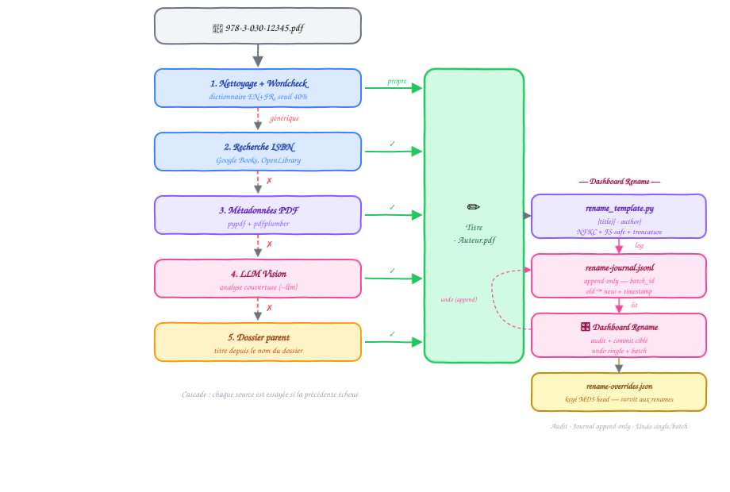

# Renommage

[← Retour au README](../README.md) · [Architecture](architecture.md)

## Vue d'ensemble

Le module de renommage transforme les noms de fichiers PDF cryptiques (`978-3-030-12345-6.pdf`, `scan_20240301.pdf`) en noms lisibles au format `Titre - Auteur.pdf`. Il utilise un pipeline en cascade de 5 sources d'information.

<p align="center">
  
</p>

## Pipeline en détail

### Étape 1 : Nettoyage

Vérifie si le nom de fichier est déjà exploitable (`is_name_clean()`). Supprime les caractères spéciaux, normalise les espaces, retire les préfixes numériques.

### Étape 2 : Recherche ISBN

Si le nom contient un ISBN (10 ou 13 chiffres), recherche dans Google Books et OpenLibrary pour récupérer le titre et l'auteur. Les résultats sont mis en cache dans `profiles/<nom>/.cache/isbn_cache.json` (~3400 entrées).

### Étape 3 : Métadonnées PDF

Extraction du titre et de l'auteur depuis les métadonnées internes du PDF via pypdf et pdfplumber. Filtre les titres génériques (`GENERIC_TITLES` : "title", "document", "untitled", etc.).

### Étape 4 : LLM Vision (optionnel, `--llm`)

Activé avec `--llm`. Le module `lib/vision.py` extrait les N premières pages du PDF comme images (via pdf2image + poppler, 150 dpi), les convertit en base64, et les envoie au modèle de vision (Qwen3-VL par défaut via SiliconFlow, ou un modèle local via Ollama).

Le prompt demande au LLM d'analyser la couverture et de retourner un JSON avec `title`, `author`, `theme`, `language` et `confidence`. Le titre doit être dans la langue originale du livre, l'auteur au format "Prénom Nom".

Avec une seule page (`--pages 1`, défaut), le prompt est orienté couverture. Avec plusieurs pages (`--pages 2` ou plus), un prompt alternatif est utilisé qui demande au LLM de chercher le titre spécifique du livre (pas le nom de la collection) — important pour les collections comme LNCS où la couverture affiche "Lecture Notes in Computer Science" et le vrai titre est sur la page 2 ou 3.

```
Entrée :
  - Image(s) base64 de la couverture (et pages internes si --pages > 1)

Réponse attendue :
  {"title": "Introduction to Algorithms", "author": "Thomas Cormen",
   "theme": "Computer Science", "language": "en", "confidence": 0.95}
```

Les réponses avec `confidence < 0.3` ou les titres génériques (listés dans `GENERIC_TITLES` : "title", "document", "untitled", etc.) sont rejetées.

Avec `--force`, le LLM Vision passe en priorité (avant ISBN et métadonnées) et re-analyse même les fichiers dont le nom est déjà considéré propre par `is_name_clean()`.

**Configuration** : endpoint et modèle dans `profile.yaml`. Paramètres d'appel : `max_tokens: 300`, `temperature: 0.1`, timeout de 30s.

### Étape 5 : Fallback dossier parent

Dernier recours : utilise le nom du dossier parent comme approximation du sujet.

## Commande CLI

```bash
# Dry-run (ISBN + métadonnées PDF)
./klodo.sh rename /chemin

# Appliquer les renommages
./klodo.sh rename /chemin --execute

# Activer LLM Vision en fallback
./klodo.sh rename /chemin --llm --execute

# Analyser 2 pages (couverture + page titre) — utile pour les LNCS
./klodo.sh rename /chemin --llm --pages 2 --execute

# Forcer LLM en priorité + 3 pages
./klodo.sh rename /chemin --llm --force --pages 3 --execute

# Test limité avec détails
./klodo.sh rename /chemin --max 10 --verbose

# Sans recherche ISBN en ligne
./klodo.sh rename /chemin --no-online --execute
```

### Options

| Option | Description |
|---|---|
| `--llm` | Activer LLM Vision en fallback (analyse couverture) |
| `--force` | LLM en priorité + re-analyser les noms "propres" |
| `--pages N` | Pages à analyser (défaut: 1, max: 5) |
| `--max N` | Limiter à N fichiers |
| ~~`--api-key`~~ | Supprimé — utiliser la variable `SILICONFLOW_API_KEY` |
| `--no-online` | Désactiver la recherche ISBN en ligne |
| `--no-pdf` | Désactiver l'extraction des métadonnées PDF |

## Cache ISBN

Les résultats de recherche ISBN sont stockés dans `profiles/<nom>/.cache/isbn_cache.json`. Ce cache accélère les prochains runs et réduit les appels réseau. Il contient ~3400 entrées après le traitement initial de la bibliothèque. Nettoyable via `./klodo.sh clean isbn --execute`.

## Module

**Fichiers** : `lib/renamer.py` (moteur), `lib/vision.py` (LLM Vision), `lib/utils.py` (sanitize).
